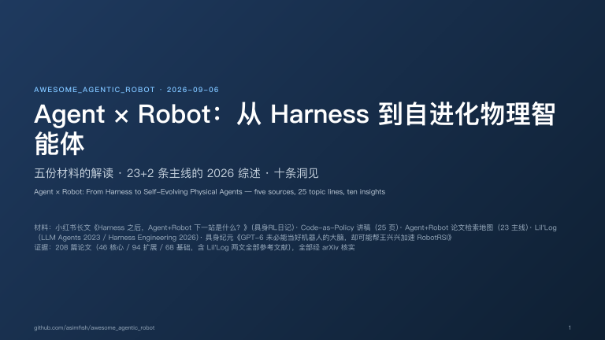
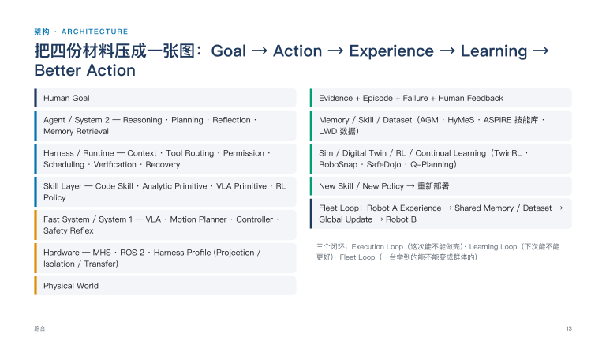

# Awesome Agentic Robot: Agent + Robot Papers, Reports and Slides

[](https://awesome.re)   

A curated reading map of **Agentic Robotics** (Agent × Robot): coding agents that write robot policies, harnesses and runtimes around frozen VLAs, robot memory, reflection and self-evolution, VLA + RL, digital twins, fleet learning, safety and hardware standards. The list follows the 23 topic lines of the "Agent + Robot 论文检索地图" and adds two lines: a foundation line (LLM agents and harness engineering) and a Robot RSI line (recursive self-improvement, from the 具身纪元 essay), so that the software-side theory and the robotics-side practice can be read together.

一份 **Agentic Robotics（Agent × Robot）** 的检索地图与解读仓库：Coding Agent 写机器人策略、围绕冻结 VLA 的 Harness 与 Runtime、机器人记忆、反思与自进化、VLA + RL、数字孪生、群体学习、安全与硬件标准。按"Agent + Robot 论文检索地图"的 23 条主线组织，并增加两条主线：基础主线（LLM Agent 与 Harness 工程）和 Robot RSI 主线（递归自我改进，来自具身纪元的文章），把软件侧理论和机器人侧实践放在一起读。

We mark robotics works that are explicitly named in the source materials (the retrieval map, the Xiaohongshu essay, the Code-as-Policy deck and the 具身纪元 Robot RSI essay) with ⭐; the remaining entries were found by an arXiv sweep of 2025-2026 work along each line. Every entry links to the paper and, when available, to code.

*Maintained by [asimfish](https://github.com/asimfish). Built on 2026-09-06 from five inputs: the Xiaohongshu essay "Harness 之后，Agent+Robot 下一站是什么？" by 具身RL日记, the 25-slide deck `code_policy_self_evolving_agents.pptx`, the two-page "Agent + Robot 论文检索地图", Lilian Weng's Lil'Log posts on LLM agents and harness engineering, and the 具身纪元 WeChat essay "GPT-6 未必能当好机器人的大脑，却可能帮王兴兴加速 RobotRSI" by Marilyn Liu. Contributions welcome via pull request; see [CONTRIBUTING.md](CONTRIBUTING.md).*

## Deliverables

| Item | 中文 | English |
|---|---|---|
| Detailed report (Markdown) | [docs/reports/report_zh.md](docs/reports/report_zh.md) | [docs/reports/report_en.md](docs/reports/report_en.md) |
| Detailed report (PDF) | [docs/reports/report_zh.pdf](docs/reports/report_zh.pdf) | [docs/reports/report_en.pdf](docs/reports/report_en.pdf) |
| Summary slides, HTML deck (19 slides, bilingual) | [docs/slides/index.html](docs/slides/index.html) — open in a browser, arrow keys to navigate, `P` prints to PDF; a pre-rendered export is [docs/slides/index.pdf](docs/slides/index.pdf) | same file |
| Summary slides, Beamer PDF (25 pages incl. backup) | [docs/slides/agentic_robot_slides.pdf](docs/slides/agentic_robot_slides.pdf) ([source](docs/slides/agentic_robot_slides.tex)) | same file |
| Source-material transcripts | [sources/](sources/) — Xiaohongshu essay transcript, deck text and notes, retrieval-map transcript, Lil'Log archives, 具身纪元 Robot RSI essay transcript | |
| Core papers, original + Chinese (SuperTranslate, layout-preserving) | [papers/pdf_zh/](papers/pdf_zh/) — see [papers/README.md](papers/README.md) for what is translated | originals in [papers/pdf/](papers/pdf/) |
| Machine-readable data | [data/papers.csv](data/papers.csv), [data/topics.csv](data/topics.csv), [data/paper_meta.json](data/paper_meta.json) | regenerate README with `python3 src/build_papers_csv.py && python3 src/generator.py` |

<p align="center">
  <a href="docs/slides/index.html"></a>
  <a href="docs/slides/index.html"></a>
</p>

### Six conclusions of the report (TL;DR)

1. **The optimised object is moving up the stack.** Code as Policies (2022) had an LLM write one policy program; SkillOpt, ASPIRE, RHO and ENPIRE (2026) have a coding agent optimise a skill document, a policy repository, a training recipe or a whole harness: $z_{t+1} = A(z_t, \tau_t, r_t, \log_t)$.
2. **"Frozen VLA + learning around it" is the 2026 default, with a ceiling.** Harness VLA, BATON, AGM, HyMeS and Zetta never touch VLA weights; LWD and Q-Planning show real-world feedback still has to be written back into weights.
3. **The verifier is the bottleneck and a new scaling axis.** SessionVerifier, Evaluation as Exit Codes, evidence-gated progress pointers, LLM-as-a-Verifier.
4. **Harness became a real-time-systems problem.** A robot harness intervenes in control, compute and communication at once and must know latency, deadlines and fallbacks.
5. **Fleets are the route to experience at scale, with sublinear returns.** 16 robots take one VLA to 95% (LWD); 8 stations give 2-3× speed, not 8× (ENPIRE).
6. **Robot RSI is the frame that ties it together.** The 具身纪元 essay's two axes (what is improved: deployment-time / training-time / evaluator / research process × how much a human is in the loop) place ENPIRE, ASPIRE, RoboHarness, RoboClaw, PRIMO R1, VERITAS, Eureka and DrEureka next to Reflexion, STaR, Let's Verify, Meta-Rewarding and The AI Scientist; the frontier LLM is more likely to become the cognitive hub of the robot research loop than the robot's end-effector controller.

## Repository layout

```
README.md                  this file (generated from data/*.csv by src/generator.py)
data/                      topics.csv (25 lines), papers.csv (169 entries), paper_meta.json (arXiv metadata), header.md
docs/reports/              report_zh.md/.pdf, report_en.md/.pdf, LaTeX header + pandoc Lua filter + build scripts
docs/slides/               index.html (HTML deck) + index.pdf, agentic_robot_slides.tex/.pdf (Beamer)
papers/pdf/                original PDFs of the five core papers
papers/pdf_zh/             Chinese versions rendered by SuperTranslate; *.inspect.json = QA report
papers/translations/       human translation tables used by scripts/manual_translate.py
sources/                   transcripts and archives of the four input materials
scripts/                   download_papers.sh, translate_papers.sh, manual_translate.py, export_slides_pdf.py, build_docs.sh
src/                       fetch_arxiv_meta.py, build_papers_csv.py, generator.py
```

## How the list is organised

Each topic line below lists the works in chronological order. The first line of an entry is `**Title.** Venue, Year. [paper] [code]`, the second line is the author list, and core entries carry a one-sentence Chinese note on what the work contributes to the line. A paper that belongs to several lines appears under each of them.


## [Content](#content)

<table>
<tr>
	<td>&emsp;<a href=#foundations-llm-agents--harness-engineering>0. Foundations: LLM Agents &amp; Harness Engineering (基础：LLM Agent 与 Harness 工程)</a></td>
	<td>&emsp;<a href=#agent--robot-overview>1. Agent + Robot Overview (Agent + Robot 总览)</a></td>
</tr>
<tr>
	<td>&emsp;<a href=#coding-agents-control-robots>2. Coding Agents Control Robots (Coding Agent 控机器人)</a></td>
	<td>&emsp;<a href=#openclaw--ros>3. OpenClaw / ROS</a></td>
</tr>
<tr>
	<td>&emsp;<a href=#long-horizon-tasks>4. Long-Horizon Tasks (长程任务)</a></td>
	<td>&emsp;<a href=#robot-memory>5. Robot Memory</a></td>
</tr>
<tr>
	<td>&emsp;<a href=#reflection--failure-correction>6. Reflection / Failure Correction (Reflection / 反思纠错)</a></td>
	<td>&emsp;<a href=#self-evolution>7. Self-Evolution (Self-Evolution / 自进化)</a></td>
</tr>
<tr>
	<td>&emsp;<a href=#skill-library>8. Skill Library (Skill Library / 技能库)</a></td>
	<td>&emsp;<a href=#vla--rl>9. VLA + RL</a></td>
</tr>
<tr>
	<td>&emsp;<a href=#deployment-data-flywheel>10. Deployment Data Flywheel (部署数据回流)</a></td>
	<td>&emsp;<a href=#digital-twin--sim2real>11. Digital Twin / Sim2Real (数字孪生 / Sim2Real)</a></td>
</tr>
<tr>
	<td>&emsp;<a href=#world-model>12. World Model</a></td>
	<td>&emsp;<a href=#fast-slow-dual-systems>13. Fast-Slow Dual Systems (快慢双系统)</a></td>
</tr>
<tr>
	<td>&emsp;<a href=#edge-agent--on-device-deployment>14. Edge Agent / On-Device Deployment (Edge Agent / 端侧部署)</a></td>
	<td>&emsp;<a href=#harness>15. Harness</a></td>
</tr>
<tr>
	<td>&emsp;<a href=#runtime>16. Runtime</a></td>
	<td>&emsp;<a href=#safety>17. Safety (安全)</a></td>
</tr>
<tr>
	<td>&emsp;<a href=#standard-interfaces--hardware-api>18. Standard Interfaces / Hardware API (标准接口 / Hardware API)</a></td>
	<td>&emsp;<a href=#multi-robot-collaboration>19. Multi-Robot Collaboration (多机器人协作)</a></td>
</tr>
<tr>
	<td>&emsp;<a href=#cross-embodiment>20. Cross-Embodiment (跨本体)</a></td>
	<td>&emsp;<a href=#fleet-learning>21. Fleet Learning (群体学习 / Fleet Learning)</a></td>
</tr>
<tr>
	<td>&emsp;<a href=#active-perception>22. Active Perception (主动感知)</a></td>
	<td>&emsp;<a href=#verifier--success-verification>23. Verifier / Success Verification (Verifier / 成功验证)</a></td>
</tr>
<tr>
	<td>&emsp;<a href=#robot-rsi-recursive-self-improvement>24. Robot RSI: Recursive Self-Improvement (Robot RSI：递归自我改进)</a></td>
</tr>
</table>

### [Foundations: LLM Agents & Harness Engineering](#content)

*基础：LLM Agent 与 Harness 工程* &nbsp;|&nbsp; keywords: `LLM agent / harness engineering / recursive self-improvement / context engineering / agentic workflow search` &nbsp;|&nbsp; representative: Lil'Log (LLM Powered Autonomous Agents; Harness Engineering for Self-Improvement), ACE, Meta-Harness, Self-Harness, DGM

1. **Gödel Machines: Self-Referential Universal Problem Solvers Making Provably Optimal Self-Improvements.** arXiv, 2003. [paper](https://arxiv.org/abs/cs/0309048)

    *Jürgen Schmidhuber*

    > 自我改写的形式化起点：只有能证明某项修改会提高既定效用时才执行修改。

2. **STaR: Bootstrapping Reasoning With Reasoning.** NeurIPS 2022, 2022. [paper](https://arxiv.org/abs/2203.14465)

    *Eric Zelikman, Yuhuai Wu, Jesse Mu, Noah D. Goodman*

    > 训练时自迭代：生成推理 → 答对保留、答错看答案重推 → 筛出的过程微调下一版模型。

3. **Reflexion: Language Agents with Verbal Reinforcement Learning.** NeurIPS 2023, 2023. [paper](https://arxiv.org/abs/2303.11366) [code](https://github.com/noahshinn/reflexion)

    *Noah Shinn, Federico Cassano, Edward Berman, Ashwin Gopinath, Karthik Narasimhan, Shunyu Yao*

    > 部署时的记忆自改进：把测试 / 环境反馈写成反思存进记忆再重试，不更新权重；HumanEval 91%。

4. **Let's Verify Step by Step.** ICLR 2024, 2023. [paper](https://arxiv.org/abs/2305.20050)

    *Hunter Lightman, Vineet Kosaraju, Yura Burda, Harri Edwards, Bowen Baker, Teddy Lee, Jan Leike, John Schulman, Ilya Sutskever, Karl Cobbe*

    > 过程奖励模型：逐步标出推理出错位置而非只看最终答案，为 RSI 提供细粒度评价信号。

5. **LLM Powered Autonomous Agents.** Lil'Log, 2023. [paper](https://lilianweng.github.io/posts/2023-06-23-agent/) [code](https://lilianweng.github.io/posts/2023-06-23-agent/)

    *Lilian Weng*

    > Agent = LLM + Planning + Memory + Tool use 的经典分解，是后续所有 Agent+Robot 架构图的原型。

6. **Promptbreeder: Self-Referential Self-Improvement Via Prompt Evolution.** arXiv, 2023. [paper](https://arxiv.org/abs/2309.16797)

    *Chrisantha Fernando, Dylan Banarse, Henryk Michalewski, Simon Osindero, Tim Rocktäschel*

    > 自指式 prompt 演化，突变 prompt 本身也被演化。

7. **Self-Taught Optimizer (STOP): Recursively Self-Improving Code Generation.** arXiv, 2023. [paper](https://arxiv.org/abs/2310.02304)

    *Eric Zelikman, Eliana Lorch, Lester Mackey, Adam Tauman Kalai*

    > 自学优化器：优化 improver 而非解本身；弱模型下会退化。

8. **Meta-Rewarding Language Models: Self-Improving Alignment with LLM-as-a-Meta-Judge.** arXiv, 2024. [paper](https://arxiv.org/abs/2407.19594)

    *Tianhao Wu, Weizhe Yuan, Olga Golovneva, Jing Xu, Yuandong Tian, Jiantao Jiao, Jason Weston, Sainbayar Sukhbaatar*

    > 同一模型既当回答者、评审者和“评审的评审”，评价能力本身自改进；四轮后 AlpacaEval 2 LC 胜率 22.9%→39.4%。

9. **The AI Scientist: Towards Fully Automated Open-Ended Scientific Discovery.** arXiv, 2024. [paper](https://arxiv.org/abs/2408.06292) [code](https://github.com/SakanaAI/AI-Scientist)

    *Chris Lu, Cong Lu, Robert Tjarko Lange, Jakob Foerster, Jeff Clune, David Ha*

    > 自动研究：从代码模板出发提想法、查新颖性、改代码、跑实验、写论文并接受自动评审。

10. **Darwin Godel Machine: Open-Ended Evolution of Self-Improving Agents.** arXiv 2025, 2025. [paper](https://arxiv.org/abs/2505.22954)

    *Jenny Zhang, Shengran Hu, Cong Lu, Robert Lange, Jeff Clune*

    > 允许 coding agent 修改自身 harness 代码库并开放式演化，SWE-bench 20%→50%。

11. **AlphaEvolve: A coding agent for scientific and algorithmic discovery.** arXiv, 2025. [paper](https://arxiv.org/abs/2506.13131)

    *Alexander Novikov, Ngân Vũ, Marvin Eisenberger, Emilien Dupont, Po-Sen Huang, Adam Zsolt Wagner, Sergey Shirobokov, Borislav Kozlovskii, Francisco J. R. Ruiz, Abbas Mehrabian, M. Pawan Kumar, Abigail See, Swarat Chaudhuri, George Holland, Alex Davies, Sebastian Nowozin, Pushmeet Kohli, Matej Balog*

    > 冻结 LLM 生成程序 diff 的演化搜索，EVOLVE-BLOCK 标记可改区域。

12. **GEPA: Reflective Prompt Evolution Can Outperform Reinforcement Learning.** arXiv, 2025. [paper](https://arxiv.org/abs/2507.19457)

    *Lakshya A Agrawal, Shangyin Tan, Dilara Soylu, Noah Ziems, Rishi Khare, Krista Opsahl-Ong, Arnav Singhvi, Herumb Shandilya, Michael J Ryan, Meng Jiang, Christopher Potts, Koushik Sen, Alexandros G. Dimakis, Ion Stoica, Dan Klein, Matei Zaharia, Omar Khattab*

    > 反思式 prompt 演化优于 RL 的实证。

13. **Agentic Context Engineering: Evolving Contexts for Self-Improving Language Models.** ICLR 2026, 2025. [paper](https://arxiv.org/abs/2510.04618)

    *Qizheng Zhang, Changran Hu, Shubhangi Upasani, Boyuan Ma, Fenglu Hong, Vamsidhar Kamanuru, Jay Rainton, Chen Wu, Mengmeng Ji, Hanchen Li, Urmish Thakker, James Zou, Kunle Olukotun*

    > 把上下文当作可演化的 playbook：Generator/Reflector/Curator 三角色，增量条目式更新避免上下文塌缩。

14. **BigBang: Pursuing Open-Ended Intelligence through Self-Evolving Synthesis of Verifiable Frontier Tasks.** Technical report, 2026. [paper](https://endlessfrontier.tech/assets/paper.pdf) [code](https://huggingface.co/endless-frontier/BigBang-v1)

    *The BigBang Team (Endless Frontier)*

    > 出题者 / 批评者 / 元批评者三角合成可验证难题，约一万条样本更新权重；训练时自迭代 + 评价器校准，证据来自团队技术报告。

15. **Why LLMs Aren't Scientists Yet: Lessons from Four Autonomous Research Attempts.** arXiv, 2026. [paper](https://arxiv.org/abs/2601.03315)

    *Dhruv Trehan, Paras Chopra*

    > 四次自主研究尝试总结出的 6 类失败模式（训练数据默认偏置、实现漂移、记忆退化、过度乐观等）。

16. **Meta Context Engineering via Agentic Skill Evolution.** arXiv, 2026. [paper](https://arxiv.org/abs/2601.21557)

    *Haoran Ye, Xuning He, Vincent Arak, Haonan Dong, Guojie Song*

    > 双层优化：外层演化技能（上下文管理机制），内层优化任务上下文。

17. **Hyperagents.** arXiv, 2026. [paper](https://arxiv.org/abs/2603.19461)

    *Jenny Zhang, Bingchen Zhao, Wannan Yang, Jakob Foerster, Jeff Clune, Minqi Jiang, Sam Devlin, Tatiana Shavrina*

    > 引入元代理控制如何修改任务代理。

18. **Meta-Harness: End-to-End Optimization of Model Harnesses.** arXiv, 2026. [paper](https://arxiv.org/abs/2603.28052)

    *Yoonho Lee, Roshen Nair, Qizheng Zhang, Kangwook Lee, Omar Khattab, Chelsea Finn*

    > 用 coding agent 优化 harness 代码本身，输出 Pareto 前沿上的 harness 候选。

19. **Agentic Harness Engineering: Observability-Driven Automatic Evolution of Coding-Agent Harnesses.** arXiv, 2026. [paper](https://arxiv.org/abs/2604.25850)

    *Jiahang Lin, Shichun Liu, Chengjun Pan, Lizhi Lin, Shihan Dou, Zhiheng Xi, Xuanjing Huang, Hang Yan, Zhenhua Han, Tao Gui, Yu-Gang Jiang*

    > 以可观测性为核心：组件 / 经验 / 决策三层可观测，每次编辑都是可证伪的文件级声明。

20. **Continual Harness: Online Adaptation for Self-Improving Foundation Agents.** arXiv, 2026. [paper](https://arxiv.org/abs/2605.09998)

    *Seth Karten, Joel Zhang, Tersoo Upaa, Ruirong Feng, Wenzhe Li, Chengshuai Shi, Chi Jin, Kiran Vodrahalli*

    > 长程游戏中同时更新 harness 与蒸馏策略模型。

21. **⭐SkillOpt: Executive Strategy for Self-Evolving Agent Skills.** arXiv, 2026. [paper](https://arxiv.org/abs/2605.23904) [code](https://aka.ms/skillopt)

    *Yifan Yang, Ziyang Gong, Weiquan Huang, Qihao Yang, Ziwei Zhou, Zisu Huang, Yan Li, Xuemei Gao, Qi Dai, Bei Liu, Kai Qiu, Yuqing Yang, Dongdong Chen, Xue Yang, Chong Luo*

    > 把 skill.md 当冻结 agent 的外部可训练状态：有界编辑 + held-out 验证门 + 拒绝编辑缓冲 + epoch 慢更新；52/52 cells 最优或并列。

22. **DemoEvolve: Overcoming Sparse Feedback in Agentic Harness Evolution with Demonstrations.** arXiv, 2026. [paper](https://arxiv.org/abs/2605.24539)

    *Lirong Che, Yuzhe yang, Peiwen lin, Chuang wang, Xueqian wang, Jian su*

    > 用人类示范补充稀疏反馈下的 harness 演化。

23. **SIA: Self Improving AI with Harness & Weight Updates.** arXiv, 2026. [paper](https://arxiv.org/abs/2605.27276)

    *Prannay Hebbar, Yogendra Manawat, Samuel Verboomen, Alesia Ivanova, Selvam Palanimalai, Kunal Bhatia, Vignesh Baskaran*

    > Feedback-Agent 决定本轮更新 harness 还是模型权重的早期尝试。

24. **You Live More Than Once: Towards Hierarchical Skill Meta-Evolving.** arXiv, 2026. [paper](https://arxiv.org/abs/2605.28390)

    *Xujun Li, Kehan Zheng, Mingyuan Zhao, Yize Geng, Jinfeng Zhou, Qi Zhu, Fei Mi, Lifeng Shang, Minlie Huang, Hongning Wang*

    > 分层技能元进化：从执行轨迹学出“怎样生成与修改技能”的元技能并反过来整理技能库，MineDojo 0.700→0.856，底层权重不变。

25. **Harness Updating Is Not Harness Benefit: Disentangling Evolution Capabilities in Self-Evolving LLM Agents.** arXiv, 2026. [paper](https://arxiv.org/abs/2605.30621)

    *Minhua Lin, Juncheng Wu, Zijun Wang, Zhan Shi, Yisi Sang, Bing He, Zewen Liu, Tianxin Wei, Zongyu Wu, Zhiwei Zhang, Dakuo Wang, Xiang Zhang, Benoit Dumoulin, Cihang Xie, Yuyin Zhou, Suhang Wang, Hanqing Lu*

    > 9B 到 Opus 的模型写 harness 的能力相近，但利用 harness 的能力非单调；模型智能仍是核心。

26. **When AI builds itself: our progress toward recursive self-improvement, and its implications.** Anthropic Institute, 2026. [paper](https://www.anthropic.com/institute/recursive-self-improvement)

    *Anthropic*

    > Anthropic 对递归自我改进的路线判断：代码建议 → 编程智能体自改代码 → AI 参与设计与训练后继系统；具身智能可能紧随，但物理制造、实验周期与部署是新的速度瓶颈。

27. **Self-Harness: Harnesses That Improve Themselves.** arXiv, 2026. [paper](https://arxiv.org/abs/2606.09498)

    *Hangfan Zhang, Shao Zhang, Kangcong Li, Chen Zhang, Yang Chen, Yiqun Zhang, Lei Bai, Shuyue Hu*

    > weakness mining → bounded harness proposal → held-in/held-out 双重回归验证的自改进循环。

28. **SkillOpt-Lite: Better and Faster Agent Self-evolution via One Line of Vibe.** arXiv, 2026. [paper](https://arxiv.org/abs/2607.03451) [code](https://github.com/EvolvingLMMs-Lab/SkillOpt-Lite)

    *Yifei Shen, Bo Li, Xinjie Zhang*

    > 零阶优化视角的最小技能优化流水线，推广到 HarnessOpt。

29. **Harness Engineering for Self-Improvement.** Lil'Log, 2026. [paper](https://lilianweng.github.io/posts/2026-07-04-harness/) [code](https://lilianweng.github.io/posts/2026-07-04-harness/)

    *Lilian Weng*

    > 定义 Harness 三大模式（工作流自动化 / 文件系统即记忆 / 子代理），提出优化对象阶梯 prompt→context→workflow→harness code→optimizer code，列出 RSI 的 7 个未解挑战。

30. **Recursive Harness Self-Improvement.** arXiv, 2026. [paper](https://arxiv.org/abs/2607.15524)

    *Hyunin Lee, Jinglue Xu, Jeffrey Seely, Donghyun Lee, Matei Zaharia, Yujin Tang*

    > harness 作为 prompt 级 agent loop 规范，用配对反馈迭代精炼。

31. **GPT-6 未必能当好机器人的大脑，却可能帮王兴兴加速 RobotRSI.** WeChat 公众号 具身纪元, 2026. [paper](https://mp.weixin.qq.com/s/DTj1be0CGhwcvaFh2WI0HA)

    *Marilyn Liu (具身纪元)*

    > 提出 Robot RSI 两条轴线：改进环节（部署时自演化 / 训练时自迭代 / 自我评估 / 自动研究）× 人的参与程度（in-the-loop / on-the-loop / closed loop）；判断前沿 LLM 更可能先成为 Robot RSI 的认知中枢而非末端控制器。

32. **A Survey on Self-Improving Test-Time Intelligence: Feedback-Driven Adapting, Learning, and Scaling at Inference.** Machine Intelligence Research, 2026. [paper](https://arxiv.org/abs/2609.01679)

    *Shuaicheng Niu, Guohao Chen, Yaofo Chen, Zhiquan Wen, Jinwu Hu, Zeshuai Deng, Deyu Chen, Shuhai Zhang, Renjie Chen, Zihao Lian, Shoukai Xu, Gang Dai, Yunbei Zhang, Wei Luo, Yifan Zhang, Mingkui Tan, Cheng Deng*

    > 统一测试时适应/学习/扩展的反馈驱动 TTI 视角，覆盖机器人。

33. **SkillGLoW: Procedural-Family Skill Consolidation for Self-Improving Agents on Long-Horizon Task Streams.** arXiv, 2026. [paper](https://arxiv.org/abs/2609.02217)

    *Ao Yan, Xin Zhang, Jiawei Du, Joey Tianyi Zhou*

    > 把复用单元定义为'过程族'，局部技能聚合为去实例化的全局先验，提交门保证不退化。

### [Agent + Robot Overview](#content)

*Agent + Robot 总览* &nbsp;|&nbsp; keywords: `Agentic Robotics / Embodied Agent / LLM Robot Agent / Physical AI Agent` &nbsp;|&nbsp; representative: AgenticLab, Agentic Robot, ManiAgent

1. **RT-2: Vision-Language-Action Models Transfer Web Knowledge to Robotic Control.** CoRL 2023, 2023. [paper](https://arxiv.org/abs/2307.15818) [code](https://robotics-transformer2.github.io)

    *Anthony Brohan, Noah Brown, Justice Carbajal, Yevgen Chebotar, Xi Chen, Krzysztof Choromanski, Tianli Ding, Danny Driess, Avinava Dubey, Chelsea Finn, Pete Florence, Chuyuan Fu, Montse Gonzalez Arenas, Keerthana Gopalakrishnan, Kehang Han, Karol Hausman, Alexander Herzog, Jasmine Hsu, Brian Ichter, Alex Irpan, Nikhil Joshi, Ryan Julian, Dmitry Kalashnikov, Yuheng Kuang, Isabel Leal, Lisa Lee, Tsang-Wei Edward Lee, Sergey Levine, Yao Lu, Henryk Michalewski, Igor Mordatch, Karl Pertsch, Kanishka Rao, Krista Reymann, Michael Ryoo, Grecia Salazar, Pannag Sanketi, Pierre Sermanet, Jaspiar Singh, Anikait Singh, Radu Soricut, Huong Tran, Vincent Vanhoucke, Quan Vuong, Ayzaan Wahid, Stefan Welker, Paul Wohlhart, Jialin Wu, Fei Xia, Ted Xiao, Peng Xu, Sichun Xu, Tianhe Yu, Brianna Zitkovich*

    > VLA 的起点：把 VLM 的网络知识迁移到机器人动作；文章将其作为 2023-2024 年机器人吃到 VLM 红利的代表。

2. **⭐Agentic Robot: A Brain-Inspired Framework for Vision-Language-Action Models in Embodied Agents.** arXiv, 2025. [paper](https://arxiv.org/abs/2505.23450) [code](https://agentic-robot.github.io)

    *Zhejian Yang, Yongchao Chen, Xueyang Zhou, Jiangyue Yan, Dingjie Song, Yinuo Liu, Yuting Li, Yu Zhang, Pan Zhou, Hechang Chen, Lichao Sun*

    > 脑启发框架：Standardized Action Procedure 协调推理模型 / VLA 执行器 / 时序验证器，LIBERO 79.6%。

3. **PhysiAgent: An Embodied Agent Framework in Physical World.** arXiv, 2025. [paper](https://arxiv.org/abs/2509.24524)

    *Zhihao Wang, Jianxiong Li, Jinliang Zheng, Wencong Zhang, Dongxiu Liu, Yinan Zheng, Haoyi Niu, Junzhi Yu, Xianyuan Zhan*

    > VLM 根据 VLA 实时熟练度反馈组织 monitor / memory / reflection 组件。

4. **⭐ManiAgent: An Agentic Framework for General Robotic Manipulation.** arXiv, 2025. [paper](https://arxiv.org/abs/2510.11660) [code](https://yi-yang929.github.io/ManiAgent/)

    *Yi Yang, Kefan Gu, Yuqing Wen, Hebei Li, Yucheng Zhao, Tiancai Wang, Xudong Liu*

    > 多 agent 感知-分解-动作生成，SimplerEnv 86.8%，可为 VLA 生成训练数据。

5. **⭐PLanAR: Planning-Language-Grounded Agentic Reasoning for Robot Manipulation.** arXiv, 2026. [paper](https://arxiv.org/abs/2602.01662) [code](https://agentic1ab.github.io/)

    *Pengyuan Guo, Zhonghao Mai, Zhengtong Xu, Kaidi Zhang, Quan Khanh Luu, Heng Zhang, Zichen Miao, Arash Ajoudani, Zachary Kingston, Qiang Qiu, Yu She*

    > Purdue 真机 agent 平台：以规划语言（谓词/动作 schema）定义 VLM 推理空间，逐步验证符号效果并重规划。

6. **Agentic AI for Robot Control: Flexible but still Fragile.** arXiv, 2026. [paper](https://arxiv.org/abs/2602.13081)

    *Oscar Lima, Marc Vinci, Martin Günther, Marian Renz, Alexander Sung, Sebastian Stock, Johannes Brust, Lennart Niecksch, Zongyao Yi, Felix Igelbrink, Benjamin Kisliuk, Martin Atzmueller, Joachim Hertzberg*

    > 两台真机上的规划-执行循环：迁移只需改系统 prompt，但非确定性与 prompt 敏感性显著。

7. **VoLo: A Physical Orchestrator for Open-Vocabulary Long-Horizon Manipulation.** arXiv, 2026. [paper](https://arxiv.org/abs/2606.07723) [code](https://chicychen.github.io/VoLo/)

    *Siyi Chen, Hugo Hadfield, Alex Zook, Mikaela Angelina Uy, Chan Hee Song, Erwin Coumans, Xuning Yang, Faisal Ladhak, Qing Qu, Stan Birchfield, Jonathan Tremblay, Valts Blukis*

    > NVIDIA Physical Orchestration：VLM 把 VLA/WAM 当作可中断工具中途干预。

8. **Guava: An Effective and Universal Harness for Embodied Manipulation.** arXiv, 2026. [paper](https://arxiv.org/abs/2606.18363)

    *Haowen Liu, Xirui Li, Shaoxiong Yao, Peng Shi, Tianyi Zhou, Jia-Bin Huang, Furong Huang, Jiayuan Mao*

    > 系统探索 harness 设计空间：迭代感知-推理-动作循环、语义动作抽象、多模态观测三要素；蒸馏进 4B 模型。

9. **HoloAgent-0: A Unified Embodied Agent Framework with 3D Spatial Memory.** arXiv, 2026. [paper](https://arxiv.org/abs/2606.23565)

    *Xiaolin Zhou, Liu Liu, Tingyang Xiao, Wei Feng, Fa Fu, Xinrui Meng, Xinjie Wang, Jialiang Han, Boyang Yu, Yun Du, Wei Sui, Zhizhong Su*

    > Embodied AgentOS + 3D 空间记忆 + 具身技能三层真机框架。

### [Coding Agents Control Robots](#content)

*Coding Agent 控机器人* &nbsp;|&nbsp; keywords: `Code-as-Policy robotics / robot coding agent / coding agents robot manipulation` &nbsp;|&nbsp; representative: Code as Policies, CaP-X, RHO, ASPIRE

1. **⭐Code as Policies: Language Model Programs for Embodied Control.** arXiv, 2022. [paper](https://arxiv.org/abs/2209.07753) [code](https://code-as-policies.github.io)

    *Jacky Liang, Wenlong Huang, Fei Xia, Peng Xu, Karol Hausman, Brian Ichter, Pete Florence, Andy Zeng*

    > 首次系统提出 Code-as-Policy：LLM 生成处理感知、调用控制原语、可表达反应式与航点式策略的程序。

2. **⭐MALMM: Multi-Agent Large Language Models for Zero-Shot Robotics Manipulation.** arXiv, 2024. [paper](https://arxiv.org/abs/2411.17636)

    *Harsh Singh, Rocktim Jyoti Das, Mingfei Han, Preslav Nakov, Ivan Laptev*

    > Planner / Coder / Supervisor 多 LLM agent 零样本操作，每步环境观测驱动重规划。

3. **⭐Growing with Your Embodied Agent: A Human-in-the-Loop Lifelong Code Generation Framework for Long-Horizon Manipulation Skills.** arXiv, 2025. [paper](https://arxiv.org/abs/2509.18597)

    *Yuan Meng, Zhenguo Sun, Max Fest, Xukun Li, Zhenshan Bing, Alois Knoll*

    > 人在环的终身代码生成：把纠正编码为可复用技能 + 外部记忆 RAG，解决 20+ 原语的超长程任务。

4. **Towards Reliable Code-as-Policies: A Neuro-Symbolic Framework for Embodied Task Planning.** NeurIPS 2025 Spotlight, 2025. [paper](https://arxiv.org/abs/2510.21302)

    *Sanghyun Ahn, Wonje Choi, Junyong Lee, Jinwoo Park, Honguk Woo*

    > NeurIPS 2025 Spotlight：符号验证 + 交互式验证代码，成功率比 CaP +46.2%。

5. **AtomBridge: Agentic VLA Inference Plugin for Long-Horizon Tasks in Scientific Experiments.** arXiv, 2026. [paper](https://arxiv.org/abs/2602.09430)

    *Yiwen Pang, Bo Zhou, Changjin Li, Xuanhao Wang, Shengxiang Xu, Deng-Bao Wang, Peng Cheng, Shimin Di, Jingkuan Song, Min-Ling Zhang*

    > 在原子技能边界由 LLM 生成过渡动作代码，8 步任务成功率 +10-25%。

6. **⭐CaP-X: A Framework for Benchmarking and Improving Coding Agents for Robot Manipulation.** arXiv, 2026. [paper](https://arxiv.org/abs/2603.22435)

    *Letian Fu, Justin Yu, Karim El-Refai, Ethan Kou, Haoru Xue, Huang Huang, Wenli Xiao, Guanzhi Wang, Dantong Niu, Fei-Fei Li, Guanya Shi, Jiajun Wu, Shankar Sastry, Yuke Zhu, Ken Goldberg, Linxi "Jim" Fan*

    > CaP-Gym / CaP-Bench / CaP-Agent0 / CaP-RL 四件套；抽象降低时性能下降，可用 agentic test-time compute 弥补；RL with verifiable reward 可 sim2real。

7. **Nautilus: From One Prompt to Plug-and-Play Robot Learning.** arXiv, 2026. [paper](https://arxiv.org/abs/2605.11665)

    *Yufeng Jin, Jianfei Guo, Xiaogang Jia, Yu Deng, Zechu Li, Han Liu, Weiran Liao, Vignesh Prasad, Mathias Franzius, Gerhard Neumann, Georgia Chalvatzaki*

    > 从一句 prompt 生成复现/评估/微调/部署工作流的开源研究 harness。

8. **HARBOR: A Harness Framework for Agentic Robot Reinforcement Learning.** arXiv, 2026. [paper](https://arxiv.org/abs/2606.08610)

    *Zechu Li, Yufeng Jin, Xiaoyang Liu, Puze Liu, Vignesh Prasad, Carlo D'Eramo, Georgia Chalvatzaki*

    > 把机器人 RL 自动化视为 harness 工程问题：从环境搭建到训练的分阶段 agent 流水线。

9. **⭐RHO: Your Coding Agent is Secretly a Roboticist.** arXiv, 2026. [paper](https://arxiv.org/abs/2606.16458) [code](https://rho-robotics.github.io)

    *Karim Elmaaroufi, Justin Svegliato, Sarunas Kalade, Graham Schelle, Sanjit A. Seshia, Matei Zaharia*

    > Robotics Harness Optimization：coding agent 在训练时搜索多文件策略仓库（Repositories-as-Policies），部署时单轮执行，LIBERO-PRO 45% vs π0.5 12.8%。

10. **Playful Agentic Robot Learning.** arXiv, 2026. [paper](https://arxiv.org/abs/2606.19419) [code](https://playful-rats.github.io/)

    *Junyi Zhang, Jiaxin Ge, Hanjun Yoo, Letian Fu, Zihan Yang, Yaowei Liu, Raj Saravanan, Shaofeng Yin, Justin Yu, Dantong Niu, Zirui Wang, Roei Herzig, Ken Goldberg, Yutong Bai, David M. Chan, Ion Stoica, Angjoo Kanazawa, Jiahui Lei, Haiwen Feng, Trevor Darrell*

    > 自主'玩耍'阶段发现技能并蒸馏进代码技能库，LIBERO-PRO 比 CaP-Agent0 +20.6pp。

11. **⭐ENPIRE: Agentic Robot Policy Self-Improvement in the Real World.** arXiv, 2026. [paper](https://arxiv.org/abs/2606.19980)

    *Wenli Xiao, Jia Xie, Tonghe Zhang, Haotian Lin, Letian "Max" Fu, Haoru Xue, Jalen Lu, Yi Yang, Cunxi Dai, Zi Wang, Jimmy Wu, Guanzhi Wang, S. Shankar Sastry, Ken Goldberg, Linxi "Jim" Fan, Yuke Zhu, Guanya Shi*

    > coding agent 的真机 harness：EN（自动 reset+验证）/ PI / R（多机并行 rollout）/ E（读日志改算法与基础设施），自主训练策略至 99% 成功。

12. **⭐ASPIRE: Agentic /Skills Discovery for Robotics.** arXiv, 2026. [paper](https://arxiv.org/abs/2607.00272) [code](https://research.nvidia.com/labs/gear/aspire/)

    *Runyu Lu, Yubo Wu, Ethan Kou, Letian Fu, Wenli Xiao, Ajay Mandlekar, Yinzhen Xu, Guanya Shi, Ken Goldberg, Ang Chen, Mosharaf Chowdhury, Yuke Zhu, Linxi "Jim" Fan, Guanzhi Wang*

    > NVIDIA GEAR：执行引擎 + 技能库 + 演化搜索的持续学习系统，技能跨任务/仿真/真机/本体持久化，LIBERO-Pro Long 零样本 31% vs 4%。

13. **Contract-Grounded Behavior Tree Synthesis via Coding Agents.** arXiv, 2026. [paper](https://arxiv.org/abs/2607.12220)

    *Jonathan Salfity, Robert Blake Anderson, Mitch Pryor*

    > coding agent 先向机器人侧 MCP server 拉取技能契约再合成行为树。

14. **MEMENTO: Memory-Guided Memetic Code-as-Policy Evolution.** arXiv, 2026. [paper](https://arxiv.org/abs/2607.22832) [code](https://github.com/sygkounas/MEMENTO)

    *Alkis Sygkounas, Victor Aregbede, Amy Loutfi, Andreas Persson*

    > 记忆引导的单精英模因式 code-as-policy 演化，先演化 rollout 评估器。

15. **A Few Words Go a Long Way: Language Guided Robot Policy Synthesis.** arXiv, 2026. [paper](https://arxiv.org/abs/2607.23784) [code](https://robo-architect.github.io/)

    *Daphne Chen, Archit Ritesh Jain, Eric Goossen, Emma Romig, Michael Murray, Nick Walker, Maya Cakmak*

    > 把策略获取视为交互式程序合成，人类语言纠正蒸馏进持久技能库。

16. **You Don't Need To Stay in The Loop: An Agentic Robotics Loop for Robot-Policy Improvement.** arXiv, 2026. [paper](https://arxiv.org/abs/2608.07555)

    *Hang Yu*

    > 策略改进的控制平面：证据分级技能库、commit 键控崩溃恢复、签名验证器。

17. **Skills in Weights, Memory in Code: Hybrid Learning for Memory-Dependent Robot Manipulation.** arXiv, 2026. [paper](https://arxiv.org/abs/2608.09410)

    *Yunhao Zhao, Zhenyang Ni, Haoyang Chen, Ruohan Zhang, Qi Zhu*

    > 权重学技能、代码管记忆：coding agent 用启发式学习迭代记忆管理系统，RoboMemArena 任务成功 41.3%→60.1%。

18. **Revisiting the "Push-T" Robot Manipulation Task with Agentic Robotics.** arXiv, 2026. [paper](https://arxiv.org/abs/2608.18227)

    *Shuangyu Xie, Kaiyuan Chen, Ken Goldberg*

    > Goldberg 组：Claude Code 无示范写出 Push-T 算法解，100% 成功且比扩散策略少 46% 步数。

19. **PhysCaP: Grounding Code-as-Policy Agent with Physics-Informed Exploration.** arXiv, 2026. [paper](https://arxiv.org/abs/2608.21031) [code](https://physcap.github.io)

    *Chen-Yu Lin, Jing-Wen Chen, Hsueh-En Chang, Hung-An Chen, Sheng-Hsun Chang, Chi-Pin Huang, Fu-En Yang, Min-Hung Chen, Yi-Ting Chen, Yu-Chiang Frank Wang, Shao-Hua Sun*

    > 物理信息驱动的主动探索层：从本体感知估计质量/刚度，Planner+Prioritizer 决定何时探索。

### [OpenClaw / ROS](#content)

*OpenClaw / ROS* &nbsp;|&nbsp; keywords: `OpenClaw robotics / ROS2 agentic robot / MCP robotics` &nbsp;|&nbsp; representative: ROSClaw, OpenClawPi, AgentRob

1. **ROSBag MCP Server: Analyzing Robot Data with LLMs for Agentic Embodied AI Applications.** arXiv, 2025. [paper](https://arxiv.org/abs/2511.03497) [code](https://github.com/binabik-ai/mcp-rosbags)

    *Lei Fu, Sahar Salimpour, Leonardo Militano, Harry Edelman, Jorge Peña Queralta, Giovanni Toffetti*

    > 用 MCP 让 LLM 分析 ROS/ROS 2 bag 数据。

2. **⭐AgentRob: From Virtual Forum Agents to Hijacked Physical Robots.** arXiv, 2026. [paper](https://arxiv.org/abs/2602.13591)

    *Wenrui Liu, Yaxuan Wang, Xun Zhang, Yanshu Wang, Jiashen Wei, Yifan Xiang, Yuhang Wang, Mingshen Ye, Elsie Dai, Zhiqi Liu, Yingjie Xu, Xinyang Chen, Hengzhe Sun, Jiyu Shen, Jingjing He, Tong Yang*

    > 通过 MCP 把论坛 agent 与 Unitree Go2/G1 相连，展示论坛介导的多 agent 机器人编排（及被劫持风险）。

3. **⭐ROSClaw: An OpenClaw ROS 2 Framework for Agentic Robot Control and Interaction.** arXiv, 2026. [paper](https://arxiv.org/abs/2603.26997)

    *Irvin Steve Cardenas, Marcus Anthony Arnett, Natalie Catherine Yeo, Lucky Sah, Jong-Hoon Kim*

    > OpenClaw runtime + ROS 2 的模型无关执行层：能力发现、观测归一、安全包络内的预执行验证、审计日志；发现不同前沿模型越权动作率差 3.4-4.8 倍。

4. **⭐OpenClawPi: AgileX Robotics Skill Set Library for OpenClaw.** Open Robotics Discourse / Hackster, 2026. [paper](https://discourse.openrobotics.org/t/rapid-deployment-of-openclaw-and-graspgen-crawling-system/53764) [code](https://discourse.openrobotics.org/t/rapid-deployment-of-openclaw-and-graspgen-crawling-system/53764)

    *AgileX Robotics*

    > 松灵机器人（AgileX）面向 OpenClaw 的模块化机器人技能库，覆盖机械臂控制、抓取等场景。

5. **OpenGo: An OpenClaw-Based Robotic Dog with Real-Time Skill Switching.** arXiv, 2026. [paper](https://arxiv.org/abs/2604.01708)

    *Hanbing Li, Xuewei Cao, Zhiwen Zeng, Yuhan Wu, Yanyong Zhang, Yan Xia*

    > OpenClaw 驱动的 Go2 机器狗：技能库 + 调度器 + 基于反馈的自学习，飞书自然语言交互。

6. **⭐ROSClaw: A Hierarchical Semantic-Physical Framework for Heterogeneous Multi-Agent Collaboration.** arXiv, 2026. [paper](https://arxiv.org/abs/2604.04664) [code](https://www.rosclaw.io/)

    *Rongfeng Zhao, Xuanhao Zhang, Zhaochen Guo, Xiang Shao, Zhongpan Zhu, Bin He, Jie Chen*

    > 同名工作：e-URDF 物理约束 + sim-real 拓扑映射，统一 VLM 控制器串起采集、训练与执行。

7. **SpaceMind: A Modular and Self-Evolving Embodied Vision-Language Agent Framework for Autonomous On-orbit Servicing.** arXiv, 2026. [paper](https://arxiv.org/abs/2604.14399) [code](https://github.com/wuaodi/SpaceMind)

    *Aodi Wu, Haodong Han, Xubo Luo, Ruisuo Wang, Shan He, Xue Wan*

    > MCP 工具 + 技能自演化的在轨服务 VLM agent，单次失败即恢复。

8. **Long-Term Memory for VLA-based Agents in Open-World Task Execution.** arXiv, 2026. [paper](https://arxiv.org/abs/2604.15671)

    *Xu Huang, Weixin Mao, Yinhao Li, Hua Chen, Jiabao Zhao*

    > 化学实验室双层记忆 + MCP 子 agent 编排 + 异步推理。

9. **Contract-Grounded Behavior Tree Synthesis via Coding Agents.** arXiv, 2026. [paper](https://arxiv.org/abs/2607.12220)

    *Jonathan Salfity, Robert Blake Anderson, Mitch Pryor*

    > coding agent 先向机器人侧 MCP server 拉取技能契约再合成行为树。

10. **⭐Previewing the Model Hardware Standard (MHS).** Anthropic Research Preview, 2026. [paper](https://www.anthropic.com/news/model-hardware-standard-research-preview) [code](https://www.anthropic.com/news/model-hardware-standard-research-preview)

    *Anthropic*

    > Anthropic 2026-08-27 研究预览：让 agent 通过统一规范发现、操作、排障真实设备（显微镜、液体处理器、机械臂），被称为硬件版 MCP。

### [Long-Horizon Tasks](#content)

*长程任务* &nbsp;|&nbsp; keywords: `long-horizon robotic manipulation agent / hierarchical robot agent` &nbsp;|&nbsp; representative: RoboClaw, H-WM, Agentic Robot, REMAC

1. **⭐REMAC: Self-Reflective and Self-Evolving Multi-Agent Collaboration for Long-Horizon Robot Manipulation.** arXiv, 2025. [paper](https://arxiv.org/abs/2503.22122)

    *Puzhen Yuan, Angyuan Ma, Yunchao Yao, Huaxiu Yao, Masayoshi Tomizuka, Mingyu Ding*

    > 多机器人长程规划：前置/后置条件检查的自反思 + 场景推理的自进化，成功率 +40%，效率 +52.7%。

2. **⭐Agentic Robot: A Brain-Inspired Framework for Vision-Language-Action Models in Embodied Agents.** arXiv, 2025. [paper](https://arxiv.org/abs/2505.23450) [code](https://agentic-robot.github.io)

    *Zhejian Yang, Yongchao Chen, Xueyang Zhou, Jiangyue Yan, Dingjie Song, Yinuo Liu, Yuting Li, Yu Zhang, Pan Zhou, Hechang Chen, Lichao Sun*

    > 脑启发框架：Standardized Action Procedure 协调推理模型 / VLA 执行器 / 时序验证器，LIBERO 79.6%。

3. **AtomBridge: Agentic VLA Inference Plugin for Long-Horizon Tasks in Scientific Experiments.** arXiv, 2026. [paper](https://arxiv.org/abs/2602.09430)

    *Yiwen Pang, Bo Zhou, Changjin Li, Xuanhao Wang, Shengxiang Xu, Deng-Bao Wang, Peng Cheng, Shimin Di, Jingkuan Song, Min-Ling Zhang*

    > 在原子技能边界由 LLM 生成过渡动作代码，8 步任务成功率 +10-25%。

4. **⭐H-WM: Robotic Task and Motion Planning Guided by Hierarchical World Model.** arXiv, 2026. [paper](https://arxiv.org/abs/2602.11291)

    *Jinbang Huang, Wenyuan Chen, Zhiyuan Li, Oscar Pang, Xiao Hu, Lingfeng Zhang, Yuanzhao Hu, Zhanguang Zhang, Mark Coates, Tongtong Cao, Xingyue Quan, Yingxue Zhang*

    > 分层世界模型：高层逻辑世界模型 + 低层视觉世界模型联合预测，为 VLA 提供稳定中间引导。

5. **Beyond Short-Horizon: VQ-Memory for Robust Long-Horizon Manipulation in Non-Markovian Simulation Benchmarks.** arXiv, 2026. [paper](https://arxiv.org/abs/2603.09513)

    *Honghui Wang, Zhi Jing, Jicong Ao, Shiji Song, Xuelong Li, Gao Huang, Chenjia Bai*

    > 非马尔可夫保险箱基准 + VQ 离散本体历史记忆。

6. **⭐RoboClaw: An Agentic Framework for Scalable Long-Horizon Robotic Tasks.** arXiv, 2026. [paper](https://arxiv.org/abs/2603.11558) [code](https://github.com/RoboClaw-Robotics/RoboClaw)

    *Ruiying Li, Yunlang Zhou, YuYao Zhu, Kylin Chen, Jingyuan Wang, Sukai Wang, Kongtao Hu, Minhui Yu, Bowen Jiang, Zhan Su, Jiayao Ma, Xin He, Yongjian Shen, Yang Yang, Guanghui Ren, Maoqing Yao, Wenhao Wang, Yao Mu*

    > 统一采集-学习-部署的 VLM 控制器；Entangled Action Pairs 把正向技能与逆向恢复绑定实现自复位采数据，成功率 +25%，人工时间 -53.7%。

7. **VoLo: A Physical Orchestrator for Open-Vocabulary Long-Horizon Manipulation.** arXiv, 2026. [paper](https://arxiv.org/abs/2606.07723) [code](https://chicychen.github.io/VoLo/)

    *Siyi Chen, Hugo Hadfield, Alex Zook, Mikaela Angelina Uy, Chan Hee Song, Erwin Coumans, Xuning Yang, Faisal Ladhak, Qing Qu, Stan Birchfield, Jonathan Tremblay, Valts Blukis*

    > NVIDIA Physical Orchestration：VLM 把 VLA/WAM 当作可中断工具中途干预。

8. **Cortex: A Bidirectionally Aligned Embodied Agent Framework for Long-horizon Manipulation.** arXiv, 2026. [paper](https://arxiv.org/abs/2607.05377)

    *Jiaqi Peng, Xiqian Yu, Delin Feng, Yuqiang Yang, Wenzhe Cai, Jing Xiong, Ganlin Yang, Jinliang Zheng, Jiafei Cao, Xueyuan Wei, Jiangmiao Pang, Yuan Shen, Tai Wang*

    > 32 个规范技能原语的双向对齐规划接口，附推理期 harness engineering。

9. **Foresight Residual RL for Long-Horizon Robot Manipulation with Vision-Language-Action Models.** IROS 2026, 2026. [paper](https://arxiv.org/abs/2607.16506)

    *Yuhan Liu, Xinyu Zhang, Litao Liu, Abdeslam Boularias*

    > 用下游成功概率（foresight value）塑形子任务交接状态。

10. **RoboHarness: Memory-Driven Orchestration of Heterogeneous Robot Policies for Long-Horizon Planning.** arXiv, 2026. [paper](https://arxiv.org/abs/2607.18060)

    *Jinbang Huang, Yuanzhao Hu, Zhiyuan Li, Ran Qi, Yixin Xiao, Zhanguang Zhang, Mark Coates, Tongtong Cao, Yingxue Zhang*

    > 多模态执行记忆刻画异构策略能力边界，Memory Bridge 把机器人引导到下一策略的分布内区域。

11. **Don't Drop the BATON: Long-Horizon Robot Manipulation via Agentic Subtask Exploration and Transition-aware Memory.** arXiv, 2026. [paper](https://arxiv.org/abs/2608.16889)

    *Bingxin Xu, Yuzhang Shang, Emilio Ferrara*

    > 以子任务为探索单元（成本 T·K 而非 T^K），转移感知记忆治理 VLA 的进入条件。

### [Robot Memory](#content)

*Robot Memory* &nbsp;|&nbsp; keywords: `robot memory / memory-augmented VLA / episodic memory robotics / history-dependent manipulation` &nbsp;|&nbsp; representative: RoboMME, PonderPounce, ViReSkill

1. **⭐ViReSkill: Vision-Grounded Replanning with Skill Memory for LLM-Based Planning in Lifelong Robot Learning.** arXiv, 2025. [paper](https://arxiv.org/abs/2509.24219)

    *Tomoyuki Kagaya, Subramanian Lakshmi, Anbang Ye, Thong Jing Yuan, Jayashree Karlekar, Sugiri Pranata, Natsuki Murakami, Akira Kinose, Yang You*

    > 失败时视觉接地重规划，成功后把计划存入技能记忆下次直接复用，无需再调 LLM。

2. **⭐RoboOS-NeXT: A Unified Memory-based Framework for Lifelong, Scalable, and Robust Multi-Robot Collaboration.** arXiv, 2025. [paper](https://arxiv.org/abs/2510.26536) [code](https://flagopen.github.io/RoboOS/)

    *Huajie Tan, Cheng Chi, Xiansheng Chen, Yuheng Ji, Zhongxia Zhao, Xiaoshuai Hao, Yaoxu Lyu, Mingyu Cao, Junkai Zhao, Huaihai Lyu, Enshen Zhou, Ning Chen, Yankai Fu, Cheng Peng, Wei Guo, Dong Liang, Zhuo Chen, Mengsi Lyu, Chenrui He, Yulong Ao, Yonghua Lin, Pengwei Wang, Zhongyuan Wang, Shanghang Zhang*

    > Spatio-Temporal-Embodiment Memory 统一多机器人终身协作的共享记忆。

3. **MeCo: Enhancing LLM-Empowered Multi-Robot Collaboration via Similar Task Memoization.** arXiv, 2026. [paper](https://arxiv.org/abs/2601.20577)

    *Baiqing Wang, Helei Cui, Bo Zhang, Xiaolong Zheng, Bin Guo, Zhiwen Yu*

    > 相似任务记忆化复用多机器人计划。

4. **⭐RoboMME: Benchmarking and Understanding Memory for Robotic Generalist Policies.** ICML 2026, 2026. [paper](https://arxiv.org/abs/2603.04639) [code](https://robomme.github.io)

    *Yinpei Dai, Hongze Fu, Jayjun Lee, Yuejiang Liu, Haoran Zhang, Jianing Yang, Chelsea Finn, Nima Fazeli, Joyce Chai*

    > ICML 2026。16 个任务覆盖时间/空间/物体/程序四类记忆，14 个 π0.5 记忆变体；记忆表示的有效性高度任务依赖。

5. **Beyond Short-Horizon: VQ-Memory for Robust Long-Horizon Manipulation in Non-Markovian Simulation Benchmarks.** arXiv, 2026. [paper](https://arxiv.org/abs/2603.09513)

    *Honghui Wang, Zhi Jing, Jicong Ao, Shiji Song, Xuelong Li, Gao Huang, Chenjia Bai*

    > 非马尔可夫保险箱基准 + VQ 离散本体历史记忆。

6. **Long-Term Memory for VLA-based Agents in Open-World Task Execution.** arXiv, 2026. [paper](https://arxiv.org/abs/2604.15671)

    *Xu Huang, Weixin Mao, Yinhao Li, Hua Chen, Jiabao Zhao*

    > 化学实验室双层记忆 + MCP 子 agent 编排 + 异步推理。

7. **⭐RoboMME-Interference: Benchmarking Robot Memory Under Interference.** arXiv, 2026. [paper](https://arxiv.org/abs/2606.22338) [code](https://robotmemorybench.com)

    *Soumil Rathi*

    > 跨会话干扰基准：感知型记忆随无关会话累积而衰减，检索步骤可恢复。

8. **HoloAgent-0: A Unified Embodied Agent Framework with 3D Spatial Memory.** arXiv, 2026. [paper](https://arxiv.org/abs/2606.23565)

    *Xiaolin Zhou, Liu Liu, Tingyang Xiao, Wei Feng, Fa Fu, Xinrui Meng, Xinjie Wang, Jialiang Han, Boyang Yu, Yun Du, Wei Sui, Zhizhong Su*

    > Embodied AgentOS + 3D 空间记忆 + 具身技能三层真机框架。

9. **Analytic Concept-Centric Memory for Agentic Embodied Manipulation.** arXiv, 2026. [paper](https://arxiv.org/abs/2606.29774)

    *Mingyang Sun, Xiujian Liang, Jiude Wei, Qichen He, Donglin Wang, Cewu Lu, Jianhua Sun*

    > 以部件/模板/位姿/affordance 组织的结构化概念记忆，连接转移记忆与技能记忆。

10. **NativeMEM: Native Memory Compression for Long-Horizon Robotic Manipulation.** arXiv, 2026. [paper](https://arxiv.org/abs/2607.06678)

    *Ziye Wang, Modi Shi, Chaojun Ni, Jiazhi Yang, Mengdi Li, Zhizhong Su, Tianwei Lin, Hongyang Li*

    > 复用 VLA 自身视觉编码器把每帧压成一个记忆 token，成功率 32.4%→84.0%。

11. **Dual Latent Memory in Vision-Language-Action Models for Robotic Manipulation.** arXiv, 2026. [paper](https://arxiv.org/abs/2607.07608) [code](https://github.com/quhongyu/LaMem-VLA)

    *Hongyu Qu, Jianzhe Gao, Xiaobin Hu, Shaohuan Yang, Xinlei Yu, Rui Yan, Wenguan Wang, Xiangbo Shu, Shuicheng Yan*

    > 短/长期记忆库在 VLA 原生潜空间中交织。

12. **RoboHarness: Memory-Driven Orchestration of Heterogeneous Robot Policies for Long-Horizon Planning.** arXiv, 2026. [paper](https://arxiv.org/abs/2607.18060)

    *Jinbang Huang, Yuanzhao Hu, Zhiyuan Li, Ran Qi, Yixin Xiao, Zhanguang Zhang, Mark Coates, Tongtong Cao, Yingxue Zhang*

    > 多模态执行记忆刻画异构策略能力边界，Memory Bridge 把机器人引导到下一策略的分布内区域。

13. **SkillMemo: Expert-guided Skill Memory Framework for Compositional Embodied Manipulation.** arXiv, 2026. [paper](https://arxiv.org/abs/2608.05970)

    *Changyuan Wang, Chubin Zhang, Zhenyu Wu, Runhao Li, Angyuan Ma, Ke Chao, Yinan Liang, Xiuwei Xu, Ziwei Wang, Yansong Tang, Jiwen Lu*

    > MoE 门控隐式切分技能原语并存入情景记忆库。

14. **OnEvoMemory: Evolving Memory through Online Robot Rollouts for Pretrained Robot Policies.** ECCV 2026 Workshop, 2026. [paper](https://arxiv.org/abs/2608.08749)

    *Zhongxi Chen, Shenqi Zong*

    > 价值引导的记忆模块，用在线 rollout 结果学习该保留哪些经验。

15. **Skills in Weights, Memory in Code: Hybrid Learning for Memory-Dependent Robot Manipulation.** arXiv, 2026. [paper](https://arxiv.org/abs/2608.09410)

    *Yunhao Zhao, Zhenyang Ni, Haoyang Chen, Ruohan Zhang, Qi Zhu*

    > 权重学技能、代码管记忆：coding agent 用启发式学习迭代记忆管理系统，RoboMemArena 任务成功 41.3%→60.1%。

16. **Remember Smarter: Visual History Compressor and Hyperbolic Experience Space for Robotic Memory.** arXiv, 2026. [paper](https://arxiv.org/abs/2608.15269)

    *Dai Zhou, Jiexi Yan, Tong Li, Yuxuan Wang, Cheng Deng*

    > Mamba 视觉历史压缩 + 双曲经验空间，LIBERO-Plus 53.6%→70.6%。

17. **Don't Drop the BATON: Long-Horizon Robot Manipulation via Agentic Subtask Exploration and Transition-aware Memory.** arXiv, 2026. [paper](https://arxiv.org/abs/2608.16889)

    *Bingxin Xu, Yuzhang Shang, Emilio Ferrara*

    > 以子任务为探索单元（成本 T·K 而非 T^K），转移感知记忆治理 VLA 的进入条件。

18. **⭐PonderPounce: A Pretrained MLLM as an Episode Context Engine for Robot Control.** arXiv, 2026. [paper](https://arxiv.org/abs/2608.24115) [code](https://worv-ai.github.io/ponderpounce/)

    *Suhwan Choi, Jaeyoon Jung, Sungkyung Kim, Yunsung Lee, Youngjae Yu*

    > 复用 MLLM 原生因果上下文作为 episode 记忆：Ponder(System2) 异步向 Pounce(System1 VLA) 发送最新认知 token；RoboMME 60.83% vs π0.5 17.93%。

19. **Memory Anchors for Continual Robot Learning.** arXiv, 2026. [paper](https://arxiv.org/abs/2608.26545) [code](https://robot-adaptation.github.io/MemoryAnchors)

    *Maximilian Du, Zhanyi Sun, Chen Xu, Paarth Shah, Masha Itkina, Shuran Song*

    > 持续学习中 10% 的关键锚点经验决定是否灾难性遗忘。

20. **AGM: Achievement-Grounded Memory for Closed-Loop Agents with Frozen VLA Policies.** arXiv, 2026. [paper](https://arxiv.org/abs/2608.29537)

    *Hongbo Gao, Zeyu Ni, Xin Wen, Siyu Xu, Ruifeng Li*

    > 成就接地记忆：只有物理证据验证子目标后才推进进度指针；可靠记忆取决于状态更新纪律而非容量。

### [Reflection / Failure Correction](#content)

*Reflection / 反思纠错* &nbsp;|&nbsp; keywords: `robot self-reflection / closed-loop replanning robot / failure reflection robotics` &nbsp;|&nbsp; representative: REMAC, AgenticLab, ASPIRE

1. **Reflexion: Language Agents with Verbal Reinforcement Learning.** NeurIPS 2023, 2023. [paper](https://arxiv.org/abs/2303.11366) [code](https://github.com/noahshinn/reflexion)

    *Noah Shinn, Federico Cassano, Edward Berman, Ashwin Gopinath, Karthik Narasimhan, Shunyu Yao*

    > 部署时的记忆自改进：把测试 / 环境反馈写成反思存进记忆再重试，不更新权重；HumanEval 91%。

2. **⭐REMAC: Self-Reflective and Self-Evolving Multi-Agent Collaboration for Long-Horizon Robot Manipulation.** arXiv, 2025. [paper](https://arxiv.org/abs/2503.22122)

    *Puzhen Yuan, Angyuan Ma, Yunchao Yao, Huaxiu Yao, Masayoshi Tomizuka, Mingyu Ding*

    > 多机器人长程规划：前置/后置条件检查的自反思 + 场景推理的自进化，成功率 +40%，效率 +52.7%。

3. **⭐ViReSkill: Vision-Grounded Replanning with Skill Memory for LLM-Based Planning in Lifelong Robot Learning.** arXiv, 2025. [paper](https://arxiv.org/abs/2509.24219)

    *Tomoyuki Kagaya, Subramanian Lakshmi, Anbang Ye, Thong Jing Yuan, Jayashree Karlekar, Sugiri Pranata, Natsuki Murakami, Akira Kinose, Yang You*

    > 失败时视觉接地重规划，成功后把计划存入技能记忆下次直接复用，无需再调 LLM。

4. **PhysiAgent: An Embodied Agent Framework in Physical World.** arXiv, 2025. [paper](https://arxiv.org/abs/2509.24524)

    *Zhihao Wang, Jianxiong Li, Jinliang Zheng, Wencong Zhang, Dongxiu Liu, Yinan Zheng, Haoyi Niu, Junzhi Yu, Xianyuan Zhan*

    > VLM 根据 VLA 实时熟练度反馈组织 monitor / memory / reflection 组件。

5. **⭐PLanAR: Planning-Language-Grounded Agentic Reasoning for Robot Manipulation.** arXiv, 2026. [paper](https://arxiv.org/abs/2602.01662) [code](https://agentic1ab.github.io/)

    *Pengyuan Guo, Zhonghao Mai, Zhengtong Xu, Kaidi Zhang, Quan Khanh Luu, Heng Zhang, Zichen Miao, Arash Ajoudani, Zachary Kingston, Qiang Qiu, Yu She*

    > Purdue 真机 agent 平台：以规划语言（谓词/动作 schema）定义 VLM 推理空间，逐步验证符号效果并重规划。

6. **Agentic AI for Robot Control: Flexible but still Fragile.** arXiv, 2026. [paper](https://arxiv.org/abs/2602.13081)

    *Oscar Lima, Marc Vinci, Martin Günther, Marian Renz, Alexander Sung, Sebastian Stock, Johannes Brust, Lennart Niecksch, Zongyao Yi, Felix Igelbrink, Benjamin Kisliuk, Martin Atzmueller, Joachim Hertzberg*

    > 两台真机上的规划-执行循环：迁移只需改系统 prompt，但非确定性与 prompt 敏感性显著。

7. **RoboGene: Boosting VLA Pre-training via Diversity-Driven Agentic Framework for Real-World Task Generation.** arXiv, 2026. [paper](https://arxiv.org/abs/2602.16444)

    *Yixue Zhang, Kun Wu, Zhi Gao, Zhen Zhao, Pei Ren, Zhiyuan Xu, Fei Liao, Xinhua Wang, Shichao Fan, Di Wu, Qiuxuan Feng, Meng Li, Zhengping Che, Chang Liu, Jian Tang*

    > 多样性驱动 + 自反思物理约束的真实任务生成 agent，18k 轨迹。

8. **Self-adapting Robotic Agents through Online Continual Reinforcement Learning with World Model Feedback.** arXiv, 2026. [paper](https://arxiv.org/abs/2603.04029)

    *Fabian Domberg, Georg Schildbach*

    > DreamerV3 预测残差检测 OOD 并自动触发微调。

9. **⭐From Passive Observer to Active Critic: Reinforcement Learning Elicits Process Reasoning for Robotic Manipulation.** arXiv, 2026. [paper](https://arxiv.org/abs/2603.15600)

    *Yibin Liu, Yaxing Lyu, Daqi Gao, Zhixuan Liang, Weiliang Tang, Shilong Mu, Xiaokang Yang, Yao Mu*

    > 7B 视频 MLLM 从“观察者”变“批评者”：以初始 / 当前画面锚定过程视频，RL 激励显式 CoT 估计进度与失败位置；RoboFail 失败检测 67%。

10. **PhysReflect-VLA: Physical Feasibility and Self-Reflective Regulation for Reliable Vision-Language-Action Policies.** arXiv, 2026. [paper](https://arxiv.org/abs/2606.27146)

    *Jiayu Yang, Tao Yang, Weijun Li, Xiang Chang, Fei Chao, Changjing Shang, Qiang Shen*

    > 可行性算子 + 动作解释算子 + LLM 反思模块的执行期可靠性框架。

11. **⭐ASPIRE: Agentic /Skills Discovery for Robotics.** arXiv, 2026. [paper](https://arxiv.org/abs/2607.00272) [code](https://research.nvidia.com/labs/gear/aspire/)

    *Runyu Lu, Yubo Wu, Ethan Kou, Letian Fu, Wenli Xiao, Ajay Mandlekar, Yinzhen Xu, Guanya Shi, Ken Goldberg, Ang Chen, Mosharaf Chowdhury, Yuke Zhu, Linxi "Jim" Fan, Guanzhi Wang*

    > NVIDIA GEAR：执行引擎 + 技能库 + 演化搜索的持续学习系统，技能跨任务/仿真/真机/本体持久化，LIBERO-Pro Long 零样本 31% vs 4%。

12. **Agentic RAG-VLM: Affordance-Aware Retrieval-Augmented Generation with Self-Reflective Planning for Robotic Grasping.** arXiv, 2026. [paper](https://arxiv.org/abs/2606.31200)

    *Tao Chen, Lizheng Liu, Jiaxu Wang, Ziyue Jiang, Ruiqi Tian, JiGuang Huo, Zhongxue Gan*

    > affordance 感知检索 + 场景图约束 + 14 类失败分类的自反思抓取。

13. **⭐Harness VLA: Steering Frozen VLAs into Reliable Manipulation Primitives via Memory-Guided Agents.** arXiv, 2026. [paper](https://arxiv.org/abs/2607.08448) [code](https://github.com/RLinf/RPent)

    *Yixian Zhang, Huanming Zhang, Feng Gao, Xiao Li, Zhihao Liu, Chunyang Zhu, Jiaxing Qiu, Yuchen Yan, Jiyuan Liu, Wenhao Tang, Zhengru Fang, Yi Nie, Changxu Wei, Yu Wang, Wenbo Ding, Chao Yu*

    > 把冻结 VLA 暴露为可重试的接触原语，与少量解析原语组合；从执行轨迹学习原语的适用范围而非扩张技能库；LIBERO-Pro +38.6pp。

14. **Zetta $ζ$: An Efficient Closed-Loop Embodied Harness for Self-Evolving Physical Intelligence.** arXiv, 2026. [paper](https://arxiv.org/abs/2608.16590)

    *Xin Ding, Liang Mi, Mingzhe Huang, Zixuan Wang, Chao Zhang, Zixu Hao, Fu Chen, Xiangyu Li, Yikai Zheng, Yaoyu Guo, Weijun Wang, Kun Li, Hao Wu, Yunxin Liu, Ting Cao*

    > 三时间尺度闭环 harness：动作频率治理 / rollout 级 critic-recovery 提议 / 验证门控技能更新；LIBERO-Pro 90.8%，推理加速 11.1x。

### [Self-Evolution](#content)

*Self-Evolution / 自进化* &nbsp;|&nbsp; keywords: `self-evolving robot agent / lifelong embodied learning / continual robot learning` &nbsp;|&nbsp; representative: Arcadia, ASPIRE, PhyAgentOS, Growing with Your Embodied Agent

1. **⭐Growing with Your Embodied Agent: A Human-in-the-Loop Lifelong Code Generation Framework for Long-Horizon Manipulation Skills.** arXiv, 2025. [paper](https://arxiv.org/abs/2509.18597)

    *Yuan Meng, Zhenguo Sun, Max Fest, Xukun Li, Zhenshan Bing, Alois Knoll*

    > 人在环的终身代码生成：把纠正编码为可复用技能 + 外部记忆 RAG，解决 20+ 原语的超长程任务。

2. **⭐Arcadia: Toward a Full-Lifecycle Framework for Embodied Lifelong Learning.** arXiv, 2025. [paper](https://arxiv.org/abs/2512.00076)

    *Minghe Gao, Juncheng Li, Yuze Lin, Xuqi Liu, Jiaming Ji, Xiaoran Pan, Zihan Xu, Xian Li, Mingjie Li, Wei Ji, Rong Wei, Rui Tang, Qizhou Wang, Kai Shen, Jun Xiao, Qi Wu, Siliang Tang, Yueting Zhuang*

    > 全生命周期闭环：自进化探索 → 生成式场景重建 → 共享具身表征 → sim-from-real 评估与演化。

3. **Self-adapting Robotic Agents through Online Continual Reinforcement Learning with World Model Feedback.** arXiv, 2026. [paper](https://arxiv.org/abs/2603.04029)

    *Fabian Domberg, Georg Schildbach*

    > DreamerV3 预测残差检测 OOD 并自动触发微调。

4. **⭐RoboClaw: An Agentic Framework for Scalable Long-Horizon Robotic Tasks.** arXiv, 2026. [paper](https://arxiv.org/abs/2603.11558) [code](https://github.com/RoboClaw-Robotics/RoboClaw)

    *Ruiying Li, Yunlang Zhou, YuYao Zhu, Kylin Chen, Jingyuan Wang, Sukai Wang, Kongtao Hu, Minhui Yu, Bowen Jiang, Zhan Su, Jiayao Ma, Xin He, Yongjian Shen, Yang Yang, Guanghui Ren, Maoqing Yao, Wenhao Wang, Yao Mu*

    > 统一采集-学习-部署的 VLM 控制器；Entangled Action Pairs 把正向技能与逆向恢复绑定实现自复位采数据，成功率 +25%，人工时间 -53.7%。

5. **SpaceMind: A Modular and Self-Evolving Embodied Vision-Language Agent Framework for Autonomous On-orbit Servicing.** arXiv, 2026. [paper](https://arxiv.org/abs/2604.14399) [code](https://github.com/wuaodi/SpaceMind)

    *Aodi Wu, Haodong Han, Xubo Luo, Ruisuo Wang, Shan He, Xue Wan*

    > MCP 工具 + 技能自演化的在轨服务 VLM agent，单次失败即恢复。

6. **⭐SkillOpt: Executive Strategy for Self-Evolving Agent Skills.** arXiv, 2026. [paper](https://arxiv.org/abs/2605.23904) [code](https://aka.ms/skillopt)

    *Yifan Yang, Ziyang Gong, Weiquan Huang, Qihao Yang, Ziwei Zhou, Zisu Huang, Yan Li, Xuemei Gao, Qi Dai, Bei Liu, Kai Qiu, Yuqing Yang, Dongdong Chen, Xue Yang, Chong Luo*

    > 把 skill.md 当冻结 agent 的外部可训练状态：有界编辑 + held-out 验证门 + 拒绝编辑缓冲 + epoch 慢更新；52/52 cells 最优或并列。

7. **VASO: Formally Verifiable Self-Evolving Skills for Physical AI Agents.** arXiv, 2026. [paper](https://arxiv.org/abs/2606.05395)

    *Yunhao Yang, Neel P. Bhatt, Kevin Wang, Samuel Tetteh, Zhangyang Wang, Ufuk Topcu*

    > 形式化可验证的自进化技能契约：模型检查反例变成文本梯度，97.2% 规范符合。

8. **Playful Agentic Robot Learning.** arXiv, 2026. [paper](https://arxiv.org/abs/2606.19419) [code](https://playful-rats.github.io/)

    *Junyi Zhang, Jiaxin Ge, Hanjun Yoo, Letian Fu, Zihan Yang, Yaowei Liu, Raj Saravanan, Shaofeng Yin, Justin Yu, Dantong Niu, Zirui Wang, Roei Herzig, Ken Goldberg, Yutong Bai, David M. Chan, Ion Stoica, Angjoo Kanazawa, Jiahui Lei, Haiwen Feng, Trevor Darrell*

    > 自主'玩耍'阶段发现技能并蒸馏进代码技能库，LIBERO-PRO 比 CaP-Agent0 +20.6pp。

9. **⭐ENPIRE: Agentic Robot Policy Self-Improvement in the Real World.** arXiv, 2026. [paper](https://arxiv.org/abs/2606.19980)

    *Wenli Xiao, Jia Xie, Tonghe Zhang, Haotian Lin, Letian "Max" Fu, Haoru Xue, Jalen Lu, Yi Yang, Cunxi Dai, Zi Wang, Jimmy Wu, Guanzhi Wang, S. Shankar Sastry, Ken Goldberg, Linxi "Jim" Fan, Yuke Zhu, Guanya Shi*

    > coding agent 的真机 harness：EN（自动 reset+验证）/ PI / R（多机并行 rollout）/ E（读日志改算法与基础设施），自主训练策略至 99% 成功。

10. **⭐ASPIRE: Agentic /Skills Discovery for Robotics.** arXiv, 2026. [paper](https://arxiv.org/abs/2607.00272) [code](https://research.nvidia.com/labs/gear/aspire/)

    *Runyu Lu, Yubo Wu, Ethan Kou, Letian Fu, Wenli Xiao, Ajay Mandlekar, Yinzhen Xu, Guanya Shi, Ken Goldberg, Ang Chen, Mosharaf Chowdhury, Yuke Zhu, Linxi "Jim" Fan, Guanzhi Wang*

    > NVIDIA GEAR：执行引擎 + 技能库 + 演化搜索的持续学习系统，技能跨任务/仿真/真机/本体持久化，LIBERO-Pro Long 零样本 31% vs 4%。

11. **SkillOpt-Lite: Better and Faster Agent Self-evolution via One Line of Vibe.** arXiv, 2026. [paper](https://arxiv.org/abs/2607.03451) [code](https://github.com/EvolvingLMMs-Lab/SkillOpt-Lite)

    *Yifei Shen, Bo Li, Xinjie Zhang*

    > 零阶优化视角的最小技能优化流水线，推广到 HarnessOpt。

12. **⭐PhyAgentOS: A Self-Evolving Operating System for Embodied Agents with Decoupled Cognitive Planning and Physical Execution.** arXiv, 2026. [paper](https://arxiv.org/abs/2607.16636)

    *Yang Liu, Weixing Chen, Xinshuai Song, Tao Pu, Siwen Mo, Yongjie Bai, Zihao Chen, Qianran Sun, Liruo Zhong, Ying Shen, Liang Lin*

    > 会话为最小调度单元的运行时：State-as-a-File、SessionVerifier 区分执行终止与语义完成、epistemic memory、分层安全；19+ 本体验证。

13. **MEMENTO: Memory-Guided Memetic Code-as-Policy Evolution.** arXiv, 2026. [paper](https://arxiv.org/abs/2607.22832) [code](https://github.com/sygkounas/MEMENTO)

    *Alkis Sygkounas, Victor Aregbede, Amy Loutfi, Andreas Persson*

    > 记忆引导的单精英模因式 code-as-policy 演化，先演化 rollout 评估器。

14. **Self-Evolving Embodied Agents via Skill-Harness Evolution.** arXiv, 2026. [paper](https://arxiv.org/abs/2608.11350)

    *Peidong Wang, Zhiming Ma, Ying Chang, Xufang Luo, Xiaocui Yang, Shi Feng, Yuqing Yang, Dongsheng Li*

    > 冻结模型同时充当规划器和优化器，演化技能与 context-code harness。

15. **Zetta $ζ$: An Efficient Closed-Loop Embodied Harness for Self-Evolving Physical Intelligence.** arXiv, 2026. [paper](https://arxiv.org/abs/2608.16590)

    *Xin Ding, Liang Mi, Mingzhe Huang, Zixuan Wang, Chao Zhang, Zixu Hao, Fu Chen, Xiangyu Li, Yikai Zheng, Yaoyu Guo, Weijun Wang, Kun Li, Hao Wu, Yunxin Liu, Ting Cao*

    > 三时间尺度闭环 harness：动作频率治理 / rollout 级 critic-recovery 提议 / 验证门控技能更新；LIBERO-Pro 90.8%，推理加速 11.1x。

16. **Beyond Imitation: Self-Improving Robot Policies via Off-Policy Q-Planning.** arXiv, 2026. [paper](https://arxiv.org/abs/2608.21204) [code](https://varungiridhar.github.io/qplanning/)

    *Varun Giridhar, Anant Khandelwal, Jeremy A. Collins, Ignat Georgiev, Animesh Garg*

    > 大 BC 策略 + 小 off-policy Q 函数，只微调 Q 即可从部署失败中自我改进。

17. **Memory Anchors for Continual Robot Learning.** arXiv, 2026. [paper](https://arxiv.org/abs/2608.26545) [code](https://robot-adaptation.github.io/MemoryAnchors)

    *Maximilian Du, Zhanyi Sun, Chen Xu, Paarth Shah, Masha Itkina, Shuran Song*

    > 持续学习中 10% 的关键锚点经验决定是否灾难性遗忘。

18. **PRACTICE: From Experience to Expertise in Self-Evolving Embodied Agents.** arXiv, 2026. [paper](https://arxiv.org/abs/2608.30760) [code](https://baai-agents.github.io/PRACTICE)

    *Ziyi Bai, Siqi Li, Tinglei Huang, Börje F. Karlsson*

    > 训练一个技能学习器对持久技能库做结构化批量编辑（增/改/合/删），执行器冻结。

19. **Motus2: A Self-Evolving General World Model for Dexterous Manipulation.** arXiv, 2026. [paper](https://arxiv.org/abs/2608.30237)

    *Hongzhe Bi, Zihao Zhou, Yihang Tang, Jingrui Pang, Shuhe Huang, Haitian Liu, Runqing Wang, Shuai Huang, Yichen Wang, Yiming Cheng, Ruowen Zhao, Zhenghua Li, Hengkai Tan, Xiaolong Liu, Jinhui Wan, Jiabao Liu, Min Zhao, Fan Bao, Jun Zhu*

    > 单模型三接口（策略/模拟器/评估器）的自进化世界模型。

20. **A Survey on Self-Improving Test-Time Intelligence: Feedback-Driven Adapting, Learning, and Scaling at Inference.** Machine Intelligence Research, 2026. [paper](https://arxiv.org/abs/2609.01679)

    *Shuaicheng Niu, Guohao Chen, Yaofo Chen, Zhiquan Wen, Jinwu Hu, Zeshuai Deng, Deyu Chen, Shuhai Zhang, Renjie Chen, Zihao Lian, Shoukai Xu, Gang Dai, Yunbei Zhang, Wei Luo, Yifan Zhang, Mingkui Tan, Cheng Deng*

    > 统一测试时适应/学习/扩展的反馈驱动 TTI 视角，覆盖机器人。

21. **SkillGLoW: Procedural-Family Skill Consolidation for Self-Improving Agents on Long-Horizon Task Streams.** arXiv, 2026. [paper](https://arxiv.org/abs/2609.02217)

    *Ao Yan, Xin Zhang, Jiawei Du, Joey Tianyi Zhou*

    > 把复用单元定义为'过程族'，局部技能聚合为去实例化的全局先验，提交门保证不退化。

### [Skill Library](#content)

*Skill Library / 技能库* &nbsp;|&nbsp; keywords: `robot skill memory / atomic skill library / autonomous skill discovery` &nbsp;|&nbsp; representative: Agentic Skill Discovery, Atomic Skill Library, ViReSkill

1. **⭐Agentic Skill Discovery.** arXiv, 2024. [paper](https://arxiv.org/abs/2405.15019) [code](https://agentic-skill-discovery.github.io/)

    *Xufeng Zhao, Cornelius Weber, Stefan Wermter*

    > 完全由 LLM 驱动的技能发现：LLM 提任务、采样奖励与成功判定函数、RL 学策略、VLM 独立验证，技能库从零生长。

2. **⭐An Atomic Skill Library Construction Method for Data-Efficient Embodied Manipulation.** arXiv, 2025. [paper](https://arxiv.org/abs/2501.15068)

    *Dongjiang Li, Bo Peng, Chang Li, Ning Qiao, Qi Zheng, Lei Sun, Yusen Qin, Bangguo Li, Yifeng Luan, Bo Wu, Yibing Zhan, Mingang Sun, Tong Xu, Lusong Li, Hui Shen, Xiaodong He*

    > 三轮数据驱动构建原子技能库：VLP 拆子任务 → 抽象技能定义 → VLA 微调。

3. **⭐Growing with Your Embodied Agent: A Human-in-the-Loop Lifelong Code Generation Framework for Long-Horizon Manipulation Skills.** arXiv, 2025. [paper](https://arxiv.org/abs/2509.18597)

    *Yuan Meng, Zhenguo Sun, Max Fest, Xukun Li, Zhenshan Bing, Alois Knoll*

    > 人在环的终身代码生成：把纠正编码为可复用技能 + 外部记忆 RAG，解决 20+ 原语的超长程任务。

4. **⭐ViReSkill: Vision-Grounded Replanning with Skill Memory for LLM-Based Planning in Lifelong Robot Learning.** arXiv, 2025. [paper](https://arxiv.org/abs/2509.24219)

    *Tomoyuki Kagaya, Subramanian Lakshmi, Anbang Ye, Thong Jing Yuan, Jayashree Karlekar, Sugiri Pranata, Natsuki Murakami, Akira Kinose, Yang You*

    > 失败时视觉接地重规划，成功后把计划存入技能记忆下次直接复用，无需再调 LLM。

5. **⭐OpenClawPi: AgileX Robotics Skill Set Library for OpenClaw.** Open Robotics Discourse / Hackster, 2026. [paper](https://discourse.openrobotics.org/t/rapid-deployment-of-openclaw-and-graspgen-crawling-system/53764) [code](https://discourse.openrobotics.org/t/rapid-deployment-of-openclaw-and-graspgen-crawling-system/53764)

    *AgileX Robotics*

    > 松灵机器人（AgileX）面向 OpenClaw 的模块化机器人技能库，覆盖机械臂控制、抓取等场景。

6. **OpenGo: An OpenClaw-Based Robotic Dog with Real-Time Skill Switching.** arXiv, 2026. [paper](https://arxiv.org/abs/2604.01708)

    *Hanbing Li, Xuewei Cao, Zhiwen Zeng, Yuhan Wu, Yanyong Zhang, Yan Xia*

    > OpenClaw 驱动的 Go2 机器狗：技能库 + 调度器 + 基于反馈的自学习，飞书自然语言交互。

7. **⭐SkillOpt: Executive Strategy for Self-Evolving Agent Skills.** arXiv, 2026. [paper](https://arxiv.org/abs/2605.23904) [code](https://aka.ms/skillopt)

    *Yifan Yang, Ziyang Gong, Weiquan Huang, Qihao Yang, Ziwei Zhou, Zisu Huang, Yan Li, Xuemei Gao, Qi Dai, Bei Liu, Kai Qiu, Yuqing Yang, Dongdong Chen, Xue Yang, Chong Luo*

    > 把 skill.md 当冻结 agent 的外部可训练状态：有界编辑 + held-out 验证门 + 拒绝编辑缓冲 + epoch 慢更新；52/52 cells 最优或并列。

8. **You Live More Than Once: Towards Hierarchical Skill Meta-Evolving.** arXiv, 2026. [paper](https://arxiv.org/abs/2605.28390)

    *Xujun Li, Kehan Zheng, Mingyuan Zhao, Yize Geng, Jinfeng Zhou, Qi Zhu, Fei Mi, Lifeng Shang, Minlie Huang, Hongning Wang*

    > 分层技能元进化：从执行轨迹学出“怎样生成与修改技能”的元技能并反过来整理技能库，MineDojo 0.700→0.856，底层权重不变。

9. **VASO: Formally Verifiable Self-Evolving Skills for Physical AI Agents.** arXiv, 2026. [paper](https://arxiv.org/abs/2606.05395)

    *Yunhao Yang, Neel P. Bhatt, Kevin Wang, Samuel Tetteh, Zhangyang Wang, Ufuk Topcu*

    > 形式化可验证的自进化技能契约：模型检查反例变成文本梯度，97.2% 规范符合。

10. **Playful Agentic Robot Learning.** arXiv, 2026. [paper](https://arxiv.org/abs/2606.19419) [code](https://playful-rats.github.io/)

    *Junyi Zhang, Jiaxin Ge, Hanjun Yoo, Letian Fu, Zihan Yang, Yaowei Liu, Raj Saravanan, Shaofeng Yin, Justin Yu, Dantong Niu, Zirui Wang, Roei Herzig, Ken Goldberg, Yutong Bai, David M. Chan, Ion Stoica, Angjoo Kanazawa, Jiahui Lei, Haiwen Feng, Trevor Darrell*

    > 自主'玩耍'阶段发现技能并蒸馏进代码技能库，LIBERO-PRO 比 CaP-Agent0 +20.6pp。

11. **Analytic Concept-Centric Memory for Agentic Embodied Manipulation.** arXiv, 2026. [paper](https://arxiv.org/abs/2606.29774)

    *Mingyang Sun, Xiujian Liang, Jiude Wei, Qichen He, Donglin Wang, Cewu Lu, Jianhua Sun*

    > 以部件/模板/位姿/affordance 组织的结构化概念记忆，连接转移记忆与技能记忆。

12. **⭐ASPIRE: Agentic /Skills Discovery for Robotics.** arXiv, 2026. [paper](https://arxiv.org/abs/2607.00272) [code](https://research.nvidia.com/labs/gear/aspire/)

    *Runyu Lu, Yubo Wu, Ethan Kou, Letian Fu, Wenli Xiao, Ajay Mandlekar, Yinzhen Xu, Guanya Shi, Ken Goldberg, Ang Chen, Mosharaf Chowdhury, Yuke Zhu, Linxi "Jim" Fan, Guanzhi Wang*

    > NVIDIA GEAR：执行引擎 + 技能库 + 演化搜索的持续学习系统，技能跨任务/仿真/真机/本体持久化，LIBERO-Pro Long 零样本 31% vs 4%。

13. **A Few Words Go a Long Way: Language Guided Robot Policy Synthesis.** arXiv, 2026. [paper](https://arxiv.org/abs/2607.23784) [code](https://robo-architect.github.io/)

    *Daphne Chen, Archit Ritesh Jain, Eric Goossen, Emma Romig, Michael Murray, Nick Walker, Maya Cakmak*

    > 把策略获取视为交互式程序合成，人类语言纠正蒸馏进持久技能库。

14. **SkillMemo: Expert-guided Skill Memory Framework for Compositional Embodied Manipulation.** arXiv, 2026. [paper](https://arxiv.org/abs/2608.05970)

    *Changyuan Wang, Chubin Zhang, Zhenyu Wu, Runhao Li, Angyuan Ma, Ke Chao, Yinan Liang, Xiuwei Xu, Ziwei Wang, Yansong Tang, Jiwen Lu*

    > MoE 门控隐式切分技能原语并存入情景记忆库。

15. **PRACTICE: From Experience to Expertise in Self-Evolving Embodied Agents.** arXiv, 2026. [paper](https://arxiv.org/abs/2608.30760) [code](https://baai-agents.github.io/PRACTICE)

    *Ziyi Bai, Siqi Li, Tinglei Huang, Börje F. Karlsson*

    > 训练一个技能学习器对持久技能库做结构化批量编辑（增/改/合/删），执行器冻结。

16. **SkillGLoW: Procedural-Family Skill Consolidation for Self-Improving Agents on Long-Horizon Task Streams.** arXiv, 2026. [paper](https://arxiv.org/abs/2609.02217)

    *Ao Yan, Xin Zhang, Jiawei Du, Joey Tianyi Zhou*

    > 把复用单元定义为'过程族'，局部技能聚合为去实例化的全局先验，提交门保证不退化。

### [VLA + RL](#content)

*VLA + RL* &nbsp;|&nbsp; keywords: `VLA reinforcement learning / online RL VLA / offline-to-online robot policy` &nbsp;|&nbsp; representative: TwinRL, LWD, SAC Flow, CaP-RL, TT-VLA

1. **⭐Eureka: Human-Level Reward Design via Coding Large Language Models.** ICLR 2024, 2023. [paper](https://arxiv.org/abs/2310.12931) [code](https://eureka-research.github.io)

    *Yecheng Jason Ma, William Liang, Guanzhi Wang, De-An Huang, Osbert Bastani, Dinesh Jayaraman, Yuke Zhu, Linxi Fan, Anima Anandkumar*

    > LLM 编写奖励函数、RL 学策略、结果反馈回 LLM 改奖励；83% 任务超过人工奖励；训练方法的自动搜索。

2. **⭐SAC Flow: Sample-Efficient Reinforcement Learning of Flow-Based Policies via Velocity-Reparameterized Sequential Modeling.** arXiv, 2025. [paper](https://arxiv.org/abs/2509.25756)

    *Yixian Zhang, Shu'ang Yu, Tonghe Zhang, Mo Guang, Haojia Hui, Kaiwen Long, Yu Wang, Chao Yu, Wenbo Ding*

    > 把 flow rollout 视为残差 RNN，用门控/解码速度网络稳定 off-policy RL 训练 flow 策略。

3. **⭐On-the-Fly VLA Adaptation via Test-Time Reinforcement Learning.** arXiv, 2026. [paper](https://arxiv.org/abs/2601.06748)

    *Changyu Liu, Yiyang Liu, Taowen Wang, Qiao Zhuang, James Chenhao Liang, Wenhao Yang, Renjing Xu, Qifan Wang, Dongfang Liu, Cheng Han*

    > 测试时 RL：用逐步任务进度密集奖励在推理时在线适配 VLA。

4. **⭐TwinRL: Digital Twin-Driven Reinforcement Learning for Real-World Robotic Manipulation.** arXiv, 2026. [paper](https://arxiv.org/abs/2602.09023)

    *Qinwen Xu, Jiaming Liu, Rui Zhou, Shaojun Shi, Nuowei Han, Zhuoyang Liu, Chenyang Gu, Shuo Gu, Yang Yue, Gao Huang, Wenzhao Zheng, Sirui Han, Peng Jia, Shanghang Zhang*

    > 手机拍摄重建数字孪生，twin 内并行 RL 预热真机 RL 并定位易失败配置；20 分钟真机交互接近 100% 成功。

5. **⭐CaP-X: A Framework for Benchmarking and Improving Coding Agents for Robot Manipulation.** arXiv, 2026. [paper](https://arxiv.org/abs/2603.22435)

    *Letian Fu, Justin Yu, Karim El-Refai, Ethan Kou, Haoru Xue, Huang Huang, Wenli Xiao, Guanzhi Wang, Dantong Niu, Fei-Fei Li, Guanya Shi, Jiajun Wu, Shankar Sastry, Yuke Zhu, Ken Goldberg, Linxi "Jim" Fan*

    > CaP-Gym / CaP-Bench / CaP-Agent0 / CaP-RL 四件套；抽象降低时性能下降，可用 agentic test-time compute 弥补；RL with verifiable reward 可 sim2real。

6. **⭐Learning While Deploying: Fleet-Scale Reinforcement Learning for Generalist Robot Policies.** arXiv, 2026. [paper](https://arxiv.org/abs/2605.00416)

    *Yi Wang, Xinchen Li, Pengwei Xie, Pu Yang, Buqing Nie, Yunuo Cai, Qinglin Zhang, Chendi Qu, Jeffrey Wu, Jianheng Song, Xinlin Ren, Jingshun Huang, Mingjie Pan, Siyuan Feng, Zhi Chen, Jianlan Luo*

    > 16 台双臂机器人 fleet-scale 离线到在线 RL 持续后训练通用 VLA（DIVL + QAM），8 个真实任务平均 95%。

7. **HARBOR: A Harness Framework for Agentic Robot Reinforcement Learning.** arXiv, 2026. [paper](https://arxiv.org/abs/2606.08610)

    *Zechu Li, Yufeng Jin, Xiaoyang Liu, Puze Liu, Vignesh Prasad, Carlo D'Eramo, Georgia Chalvatzaki*

    > 把机器人 RL 自动化视为 harness 工程问题：从环境搭建到训练的分阶段 agent 流水线。

8. **SafeDojo: Safe Reinforcement Learning for VLA via Interactive World Model.** arXiv, 2026. [paper](https://arxiv.org/abs/2606.20698)

    *Kai Tang, Peidong Jia, Zhong Chu, Jixian Wu, Rui Ma, Jiajun Cao, Fangyuan Zhao, Sixiang Chen, Yichen Guo, Xiaowei Chi, Chun-Kai Fan, Kevin Zhang, Jinchang Xu, Fubing Yang, Weishi Mi, Xiaozhu Ju, Jian Tang, Shanghang Zhang*

    > 交互式视频世界模型上的安全 RL，Lagrangian 约束 GRPO。

9. **⭐Visual Verification Enables Inference-time Steering and Autonomous Policy Improvement.** arXiv, 2026. [paper](https://arxiv.org/abs/2606.18247) [code](https://veritas-improvement.github.io/)

    *Mingtong Zhang, Dhruv Shah*

    > 生成器-验证器框架：冻结通用策略 + 无梯度视觉验证器做推理时引导，验证过的自生成轨迹再微调策略；50 条自主轨迹 70% vs 同量人工示范 65%。

10. **⭐ENPIRE: Agentic Robot Policy Self-Improvement in the Real World.** arXiv, 2026. [paper](https://arxiv.org/abs/2606.19980)

    *Wenli Xiao, Jia Xie, Tonghe Zhang, Haotian Lin, Letian "Max" Fu, Haoru Xue, Jalen Lu, Yi Yang, Cunxi Dai, Zi Wang, Jimmy Wu, Guanzhi Wang, S. Shankar Sastry, Ken Goldberg, Linxi "Jim" Fan, Yuke Zhu, Guanya Shi*

    > coding agent 的真机 harness：EN（自动 reset+验证）/ PI / R（多机并行 rollout）/ E（读日志改算法与基础设施），自主训练策略至 99% 成功。

11. **Trust Your Instincts: Confidence-Driven Test-Time RL for Vision-Language-Action Models.** arXiv, 2026. [paper](https://arxiv.org/abs/2606.29892)

    *Siyao Chen, Jiakang Yuan, Jiaxin Wang, Tao Chen*

    > 利用生成置信度作为内在奖励的测试时 RL。

12. **Z-1: Efficient Reinforcement Learning for Vision-Language-Action Models.** arXiv, 2026. [paper](https://arxiv.org/abs/2606.31846)

    *Lang Cao, Renhong Chen, Luyi Li, Peng Wang, Mofan Peng, Yitong Li*

    > π0.5 上的任务级 GRPO 后训练，RoboCasa 24 任务 80.6%。

13. **Foresight Residual RL for Long-Horizon Robot Manipulation with Vision-Language-Action Models.** IROS 2026, 2026. [paper](https://arxiv.org/abs/2607.16506)

    *Yuhan Liu, Xinyu Zhang, Litao Liu, Abdeslam Boularias*

    > 用下游成功概率（foresight value）塑形子任务交接状态。

14. **RL$^2$-VLA: Adaptive RL Latent Compositional Steering with Test-Time Scaling for Vision-Language-Action Models.** arXiv, 2026. [paper](https://arxiv.org/abs/2607.26991) [code](https://rl2-vla.github.io)

    *Derek Ming Siang Tan, Shailesh Shailesh, Srikrishna Iyer, William Wei Jie Teo, Yuanliang Ju, Qiao Gu, Guillaume Sartoretti*

    > 仅在预测失败时激活的 latent 组合式推理期引导。

15. **WCM: A World Critic Model for Vision-Language-Action Reinforcement Learning.** arXiv, 2026. [paper](https://arxiv.org/abs/2607.29613)

    *Senyu Fei, Xiaopeng Yu, Siyin Wang, Xianzhong Zhao, Jingjing Gong, Xipeng Qiu*

    > 世界批评家模型：critic 同时预测未来 latent 与价值，149 任务 SOTA。

16. **TEMPO: Semantic-Action Decoupled RL Post-Training for Vision-Language-Action Models.** arXiv, 2026. [paper](https://arxiv.org/abs/2608.07314)

    *Ziheng Liu, Quantao Yang*

    > 语义-动作解耦的双时间尺度 RL 后训练。

17. **OnEvoMemory: Evolving Memory through Online Robot Rollouts for Pretrained Robot Policies.** ECCV 2026 Workshop, 2026. [paper](https://arxiv.org/abs/2608.08749)

    *Zhongxi Chen, Shenqi Zong*

    > 价值引导的记忆模块，用在线 rollout 结果学习该保留哪些经验。

18. **Temporal GRPO: Beyond Trajectory-Level Credit in Vision-Language-Action Reinforcement Learning.** arXiv, 2026. [paper](https://arxiv.org/abs/2608.13026)

    *Yao Zhou, Hang Gao, Fengge Wu, Changwen Zheng, Wenwen Qiang*

    > 按可检测任务阶段分配优势，解决轨迹级信用混叠。

19. **Beyond Imitation: Self-Improving Robot Policies via Off-Policy Q-Planning.** arXiv, 2026. [paper](https://arxiv.org/abs/2608.21204) [code](https://varungiridhar.github.io/qplanning/)

    *Varun Giridhar, Anant Khandelwal, Jeremy A. Collins, Ignat Georgiev, Animesh Garg*

    > 大 BC 策略 + 小 off-policy Q 函数，只微调 Q 即可从部署失败中自我改进。

20. **Learning to Act While Waiting: RL Finetuning of Generalist Robot Policies Under Inference Latency.** arXiv, 2026. [paper](https://arxiv.org/abs/2608.23831)

    *Brian Zhu, Momen Khalil, E Harrison, Emanuele Poggi, Philipp Schmitt, Bernd Kast, Philine Meister, Pranav Atreya, Qiyang Li, Finn Ferchau, Cesar Colmenero, Yash Shahapurkar, Gokul Narayanan, Melih Erdogan, Kai Wurm, Georg von Wichert, Oier Mees, Eugen Solowjow, Andrew Wagenmaker, Sergey Levine*

    > 推理延迟下的异步 RL：状态增广恢复近马尔可夫性。

### [Deployment Data Flywheel](#content)

*部署数据回流* &nbsp;|&nbsp; keywords: `learning while deploying robot / fleet robot learning / deployment feedback robot policy` &nbsp;|&nbsp; representative: Learning While Deploying, RoboClaw, Arcadia

1. **⭐Arcadia: Toward a Full-Lifecycle Framework for Embodied Lifelong Learning.** arXiv, 2025. [paper](https://arxiv.org/abs/2512.00076)

    *Minghe Gao, Juncheng Li, Yuze Lin, Xuqi Liu, Jiaming Ji, Xiaoran Pan, Zihan Xu, Xian Li, Mingjie Li, Wei Ji, Rong Wei, Rui Tang, Qizhou Wang, Kai Shen, Jun Xiao, Qi Wu, Siliang Tang, Yueting Zhuang*

    > 全生命周期闭环：自进化探索 → 生成式场景重建 → 共享具身表征 → sim-from-real 评估与演化。

2. **RoboGene: Boosting VLA Pre-training via Diversity-Driven Agentic Framework for Real-World Task Generation.** arXiv, 2026. [paper](https://arxiv.org/abs/2602.16444)

    *Yixue Zhang, Kun Wu, Zhi Gao, Zhen Zhao, Pei Ren, Zhiyuan Xu, Fei Liao, Xinhua Wang, Shichao Fan, Di Wu, Qiuxuan Feng, Meng Li, Zhengping Che, Chang Liu, Jian Tang*

    > 多样性驱动 + 自反思物理约束的真实任务生成 agent，18k 轨迹。

3. **⭐RoboClaw: An Agentic Framework for Scalable Long-Horizon Robotic Tasks.** arXiv, 2026. [paper](https://arxiv.org/abs/2603.11558) [code](https://github.com/RoboClaw-Robotics/RoboClaw)

    *Ruiying Li, Yunlang Zhou, YuYao Zhu, Kylin Chen, Jingyuan Wang, Sukai Wang, Kongtao Hu, Minhui Yu, Bowen Jiang, Zhan Su, Jiayao Ma, Xin He, Yongjian Shen, Yang Yang, Guanghui Ren, Maoqing Yao, Wenhao Wang, Yao Mu*

    > 统一采集-学习-部署的 VLM 控制器；Entangled Action Pairs 把正向技能与逆向恢复绑定实现自复位采数据，成功率 +25%，人工时间 -53.7%。

4. **⭐Learning While Deploying: Fleet-Scale Reinforcement Learning for Generalist Robot Policies.** arXiv, 2026. [paper](https://arxiv.org/abs/2605.00416)

    *Yi Wang, Xinchen Li, Pengwei Xie, Pu Yang, Buqing Nie, Yunuo Cai, Qinglin Zhang, Chendi Qu, Jeffrey Wu, Jianheng Song, Xinlin Ren, Jingshun Huang, Mingjie Pan, Siyuan Feng, Zhi Chen, Jianlan Luo*

    > 16 台双臂机器人 fleet-scale 离线到在线 RL 持续后训练通用 VLA（DIVL + QAM），8 个真实任务平均 95%。

5. **⭐Visual Verification Enables Inference-time Steering and Autonomous Policy Improvement.** arXiv, 2026. [paper](https://arxiv.org/abs/2606.18247) [code](https://veritas-improvement.github.io/)

    *Mingtong Zhang, Dhruv Shah*

    > 生成器-验证器框架：冻结通用策略 + 无梯度视觉验证器做推理时引导，验证过的自生成轨迹再微调策略；50 条自主轨迹 70% vs 同量人工示范 65%。

6. **⭐ENPIRE: Agentic Robot Policy Self-Improvement in the Real World.** arXiv, 2026. [paper](https://arxiv.org/abs/2606.19980)

    *Wenli Xiao, Jia Xie, Tonghe Zhang, Haotian Lin, Letian "Max" Fu, Haoru Xue, Jalen Lu, Yi Yang, Cunxi Dai, Zi Wang, Jimmy Wu, Guanzhi Wang, S. Shankar Sastry, Ken Goldberg, Linxi "Jim" Fan, Yuke Zhu, Guanya Shi*

    > coding agent 的真机 harness：EN（自动 reset+验证）/ PI / R（多机并行 rollout）/ E（读日志改算法与基础设施），自主训练策略至 99% 成功。

7. **You Don't Need To Stay in The Loop: An Agentic Robotics Loop for Robot-Policy Improvement.** arXiv, 2026. [paper](https://arxiv.org/abs/2608.07555)

    *Hang Yu*

    > 策略改进的控制平面：证据分级技能库、commit 键控崩溃恢复、签名验证器。

8. **Beyond Imitation: Self-Improving Robot Policies via Off-Policy Q-Planning.** arXiv, 2026. [paper](https://arxiv.org/abs/2608.21204) [code](https://varungiridhar.github.io/qplanning/)

    *Varun Giridhar, Anant Khandelwal, Jeremy A. Collins, Ignat Georgiev, Animesh Garg*

    > 大 BC 策略 + 小 off-policy Q 函数，只微调 Q 即可从部署失败中自我改进。

### [Digital Twin / Sim2Real](#content)

*数字孪生 / Sim2Real* &nbsp;|&nbsp; keywords: `digital twin robot RL / sim-from-real robotics / simulation guided robot learning` &nbsp;|&nbsp; representative: TwinRL, Arcadia

1. **⭐DrEureka: Language Model Guided Sim-To-Real Transfer.** RSS 2024, 2024. [paper](https://arxiv.org/abs/2406.01967) [code](https://eureka-research.github.io/dr-eureka/)

    *Yecheng Jason Ma, William Liang, Hung-Ju Wang, Sam Wang, Yuke Zhu, Linxi Fan, Osbert Bastani, Dinesh Jayaraman*

    > LLM 同时写奖励与域随机化参数范围（摩擦、质量、外力），四足机器人仿真学会站瑜伽球并迁移真机；自动研究推进到 sim-to-real。

2. **⭐Arcadia: Toward a Full-Lifecycle Framework for Embodied Lifelong Learning.** arXiv, 2025. [paper](https://arxiv.org/abs/2512.00076)

    *Minghe Gao, Juncheng Li, Yuze Lin, Xuqi Liu, Jiaming Ji, Xiaoran Pan, Zihan Xu, Xian Li, Mingjie Li, Wei Ji, Rong Wei, Rui Tang, Qizhou Wang, Kai Shen, Jun Xiao, Qi Wu, Siliang Tang, Yueting Zhuang*

    > 全生命周期闭环：自进化探索 → 生成式场景重建 → 共享具身表征 → sim-from-real 评估与演化。

3. **Real2Sim via Active Perception with Behavior Trees Automatically Generated by VLMs.** arXiv, 2026. [paper](https://arxiv.org/abs/2601.08454)

    *Alessandro Adami, Sebastian Zudaire, Ruggero Carli, Pietro Falco*

    > VLM 生成行为树主动获取缺失物理参数。

4. **⭐TwinRL: Digital Twin-Driven Reinforcement Learning for Real-World Robotic Manipulation.** arXiv, 2026. [paper](https://arxiv.org/abs/2602.09023)

    *Qinwen Xu, Jiaming Liu, Rui Zhou, Shaojun Shi, Nuowei Han, Zhuoyang Liu, Chenyang Gu, Shuo Gu, Yang Yue, Gao Huang, Wenzhao Zheng, Sirui Han, Peng Jia, Shanghang Zhang*

    > 手机拍摄重建数字孪生，twin 内并行 RL 预热真机 RL 并定位易失败配置；20 分钟真机交互接近 100% 成功。

5. **PerceptTwin: Semantic Scene Reconstruction for Iterative LLM Planning and Verification.** ICRA 2026, 2026. [paper](https://arxiv.org/abs/2606.04226)

    *Charlie Gauthier, Sacha Morin, Liam Paull*

    > ICRA 2026：从感知栈自动构建交互仿真以验证与精炼计划，成功率 +39%。

6. **A Scalable Embodied Intelligence Platform for Seamless Real-to-Sim-to-Real Transfer of Household Mobile Manipulation Tasks.** CCF TPCI, 2026. [paper](https://arxiv.org/abs/2606.18646)

    *Kui Yang, Xianlei Long, Haoxuan Li, Yan Ding, Chao Chen*

    > 自动场景生成 + 硬件无关中间件的 real-to-sim-to-real 平台。

7. **ConCent: Contact-Centric Real-to-Sim-to-Real Learning from One Demonstration.** arXiv, 2026. [paper](https://arxiv.org/abs/2606.30268)

    *Heecheol Kim, Namiko Saito, Katsushi Ikeuchi, Yasuyuki Matsushita*

    > 以接触事件序列为学习目标的 real-to-sim-to-real RL。

8. **RoboSnap: One-Shot Real-to-Sim Scene Generation for Generalizable Robot Learning and Evaluation.** arXiv, 2026. [paper](https://arxiv.org/abs/2607.06699) [code](https://robosnap.github.io)

    *Shujie Zhang, Jingkun Yi, Weipeng Zhong, Zirui Zhou, Yangkun Zhu, Hanqing Wang, Xudong Xu, Weinan Zhang, Chunhua Shen*

    > 单张 RGB 图生成可交互仿真场景，DROID-Sim 564 场景。

9. **Agentic Real2Sim: Physics-based World Modeling with Vision-Language Agents.** arXiv, 2026. [paper](https://arxiv.org/abs/2607.19190) [code](https://agentic-real2sim.github.io/)

    *Guanxiong Chen, Qianjun Xia, Jiawei Peng, Heng Zhang, Bole Ma, Justin Qian, Ziyi Jiao, Bingyang Zhou, Luoxin Ye, Kaifeng Zhang, Kunyi Wang, Weijia Zeng, Yunuo Chen, Pengzhi Yang, Ziqiu Zeng, Siyuan Luo, Huamin Wang, Chao Liu, Alan Yuille, Fan Shi, Changxi Zheng, Yunzhu Li, Chenfanfu Jiang, Peter Yichen Chen*

    > VLM agent 把真实交互录像转为可仿真的 episodic twin。

### [World Model](#content)

*World Model* &nbsp;|&nbsp; keywords: `robot world model planning / hierarchical world model robotics` &nbsp;|&nbsp; representative: H-WM

1. **⭐H-WM: Robotic Task and Motion Planning Guided by Hierarchical World Model.** arXiv, 2026. [paper](https://arxiv.org/abs/2602.11291)

    *Jinbang Huang, Wenyuan Chen, Zhiyuan Li, Oscar Pang, Xiao Hu, Lingfeng Zhang, Yuanzhao Hu, Zhanguang Zhang, Mark Coates, Tongtong Cao, Xingyue Quan, Yingxue Zhang*

    > 分层世界模型：高层逻辑世界模型 + 低层视觉世界模型联合预测，为 VLA 提供稳定中间引导。

2. **Self-adapting Robotic Agents through Online Continual Reinforcement Learning with World Model Feedback.** arXiv, 2026. [paper](https://arxiv.org/abs/2603.04029)

    *Fabian Domberg, Georg Schildbach*

    > DreamerV3 预测残差检测 OOD 并自动触发微调。

3. **Embodied Multi-Agent Coordination by Aligning World Models Through Dialogue.** arXiv, 2026. [paper](https://arxiv.org/abs/2605.12920)

    *Vardhan Dongre, Dilek Hakkani-Tür*

    > 对话减少 40-83pp 动作冲突但降低任务成功；提出世界模型对齐度量。

4. **SafeDojo: Safe Reinforcement Learning for VLA via Interactive World Model.** arXiv, 2026. [paper](https://arxiv.org/abs/2606.20698)

    *Kai Tang, Peidong Jia, Zhong Chu, Jixian Wu, Rui Ma, Jiajun Cao, Fangyuan Zhao, Sixiang Chen, Yichen Guo, Xiaowei Chi, Chun-Kai Fan, Kevin Zhang, Jinchang Xu, Fubing Yang, Weishi Mi, Xiaozhu Ju, Jian Tang, Shanghang Zhang*

    > 交互式视频世界模型上的安全 RL，Lagrangian 约束 GRPO。

5. **DSWAM: A Dual-System World Action Foundation Model for Fine-Grained Robot Manipulation.** arXiv, 2026. [paper](https://arxiv.org/abs/2607.04927)

    *Jian Zhu, Jianjun Zhang, Taiyi Su, Tianbin Liu, Zhangyuan Wang, Kai Xie, Zitai Huang, Chong Ma, Youzhang He, Tianjian Wang, Hanyang Wang, Weihao Ding, Yi Xu*

    > System 1 WAM 执行器 + 可选 System 2 子任务规划器。

6. **Agentic Real2Sim: Physics-based World Modeling with Vision-Language Agents.** arXiv, 2026. [paper](https://arxiv.org/abs/2607.19190) [code](https://agentic-real2sim.github.io/)

    *Guanxiong Chen, Qianjun Xia, Jiawei Peng, Heng Zhang, Bole Ma, Justin Qian, Ziyi Jiao, Bingyang Zhou, Luoxin Ye, Kaifeng Zhang, Kunyi Wang, Weijia Zeng, Yunuo Chen, Pengzhi Yang, Ziqiu Zeng, Siyuan Luo, Huamin Wang, Chao Liu, Alan Yuille, Fan Shi, Changxi Zheng, Yunzhu Li, Chenfanfu Jiang, Peter Yichen Chen*

    > VLM agent 把真实交互录像转为可仿真的 episodic twin。

7. **WCM: A World Critic Model for Vision-Language-Action Reinforcement Learning.** arXiv, 2026. [paper](https://arxiv.org/abs/2607.29613)

    *Senyu Fei, Xiaopeng Yu, Siyin Wang, Xianzhong Zhao, Jingjing Gong, Xipeng Qiu*

    > 世界批评家模型：critic 同时预测未来 latent 与价值，149 任务 SOTA。

8. **ContactGuard: Pre-Contact Execution Monitoring with Action-Conditioned Latent World Models.** arXiv, 2026. [paper](https://arxiv.org/abs/2608.13438)

    *Gehan Zheng, Matthew Johnson-Roberson, Weiming Zhi*

    > 潜空间世界模型的接触前执行监控。

9. **Motus2: A Self-Evolving General World Model for Dexterous Manipulation.** arXiv, 2026. [paper](https://arxiv.org/abs/2608.30237)

    *Hongzhe Bi, Zihao Zhou, Yihang Tang, Jingrui Pang, Shuhe Huang, Haitian Liu, Runqing Wang, Shuai Huang, Yichen Wang, Yiming Cheng, Ruowen Zhao, Zhenghua Li, Hengkai Tan, Xiaolong Liu, Jinhui Wan, Jiabao Liu, Min Zhao, Fan Bao, Jun Zhu*

    > 单模型三接口（策略/模拟器/评估器）的自进化世界模型。

### [Fast-Slow Dual Systems](#content)

*快慢双系统* &nbsp;|&nbsp; keywords: `dual-system VLA / fast slow robot reasoning / System 1 System 2 robotics` &nbsp;|&nbsp; representative: Fast-in-Slow, OneTwoVLA, StreamVLA, LaST0, RationalVLA

1. **Towards Synergistic, Generalized, and Efficient Dual-System for Robotic Manipulation.** arXiv, 2024. [paper](https://arxiv.org/abs/2410.08001) [code](https://opendrivelab.com/RoboDual/)

    *Qingwen Bu, Hongyang Li, Li Chen, Jisong Cai, Jia Zeng, Heming Cui, Maoqing Yao, Yu Qiao*

    > 通用-专家双系统，3.8x 控制频率。

2. **OpenHelix: A Short Survey, Empirical Analysis, and Open-Source Dual-System VLA Model for Robotic Manipulation.** arXiv, 2025. [paper](https://arxiv.org/abs/2505.03912) [code](https://openhelix-robot.github.io/)

    *Can Cui, Pengxiang Ding, Wenxuan Song, Shuanghao Bai, Xinyang Tong, Zirui Ge, Runze Suo, Wanqi Zhou, Yang Liu, Bofang Jia, Han Zhao, Siteng Huang, Donglin Wang*

    > 双系统 VLA 短综述 + 开源模型。

3. **⭐OneTwoVLA: A Unified Vision-Language-Action Model with Adaptive Reasoning.** arXiv, 2025. [paper](https://arxiv.org/abs/2505.11917)

    *Fanqi Lin, Ruiqian Nai, Yingdong Hu, Jiacheng You, Junming Zhao, Yang Gao*

    > 单一模型自适应切换推理与执行模式，关键时刻显式推理。

4. **⭐Fast-in-Slow: A Dual-System Foundation Model Unifying Fast Manipulation within Slow Reasoning.** arXiv, 2025. [paper](https://arxiv.org/abs/2506.01953) [code](https://fast-in-slow.github.io)

    *Hao Chen, Jiaming Liu, Chenyang Gu, Zhuoyang Liu, Renrui Zhang, Xiaoqi Li, Xiao He, Yandong Guo, Chi-Wing Fu, Shanghang Zhang, Pheng-Ann Heng*

    > System 1 嵌入 System 2 共享参数的统一双系统 VLA，action chunk=8 时 117.7 Hz。

5. **⭐RationalVLA: A Rational Vision-Language-Action Model with Dual System.** arXiv, 2025. [paper](https://arxiv.org/abs/2506.10826) [code](https://irpn-eai.github.io/RationalVLA)

    *Wenxuan Song, Jiayi Chen, Wenxue Li, Xu He, Han Zhao, Can Cui, Pengxiang Ding Shiyan Su, Feilong Tang, Xuelian Cheng, Donglin Wang, Zongyuan Ge, Xinhu Zheng, Zhe Liu, Hesheng Wang, Haoang Li*

    > RAMA 基准含 6 维缺陷指令；双系统通过可学习 latent 嵌入拒绝不可行指令。

6. **⭐LaST$_{0}$: Latent Spatio-Temporal Chain-of-Thought for Robotic Vision-Language-Action Model.** arXiv, 2026. [paper](https://arxiv.org/abs/2601.05248) [code](https://vla-last0.github.io/)

    *Zhuoyang Liu, Jiaming Liu, Hao Chen, Jiale Yu, Ziyu Guo, Chengkai Hou, Chenyang Gu, Xiangju Mi, Renrui Zhang, Kun Wu, Zhengping Che, Jian Tang, Pheng-Ann Heng, Shanghang Zhang*

    > 潜空间时空 CoT：未来视觉、3D 结构、本体状态进入 latent 推理，MoT 双专家异频运行。

7. **⭐StreamVLA: Breaking the Reason-Act Cycle via Completion-State Gating.** arXiv, 2026. [paper](https://arxiv.org/abs/2602.01100)

    *Tongqing Chen, Hang Wu, Jiasen Wang, Xiaotao Li, Lu Fang*

    > Lock-and-Gated：仅在子任务切换时触发慢思考并想象完成态，72% 时间步跳过自回归解码，延迟 -48%。

8. **Libra-VLA: Achieving Learning Equilibrium via Asynchronous Coarse-to-Fine Dual-System.** ACL 2026, 2026. [paper](https://arxiv.org/abs/2604.24921) [code](https://libra-vla.github.io/)

    *Yifei Wei, Linqing Zhong, Yi Liu, Yuxiang Lu, Xindong He, Maoqing Yao, Guanghui Ren*

    > ACL 2026：异步粗到细双系统。

9. **Latent Bridge: Feature Delta Prediction for Efficient Dual-System Vision-Language-Action Model Inference.** arXiv, 2026. [paper](https://arxiv.org/abs/2605.02739)

    *Yudong Liu, Yuan Li, Zijia Tang, Yuxi Zheng, Yueqian Lin, Qinsi Wang, Yi Li, Shuangjun Liu, Shuai Zhang, Taotao Jing, Dashan Gao, Ning Bi, Jingwei Sun, Yiran Chen, Hai Li*

    > 预测 VLM 输出 delta，减少 50-75% VLM 调用。

10. **VisualThink-VLA: Visual Intermediate Reasoning for Effective and Low-Latency Vision-Language-Action Policies.** arXiv, 2026. [paper](https://arxiv.org/abs/2605.30011)

    *Mingjian Gao, Wenqiao Zhang, Yuqian Yuan, Yang Dai, Binhe Yu, Zheqi Lv, Haoyu Zheng, Jiaqi Zhu, Zhiqi Ge, Zixuan Wan, Siliang Tang, Yueting Zhuang*

    > 视觉中间推理替代文本 CoT，延迟 8.4s→0.37s。

11. **UniFS: Unified Fast-to-Slow Hierarchical Architecture for Vision-Language-Action Models.** arXiv, 2026. [paper](https://arxiv.org/abs/2606.22794) [code](https://github.com/linsun449/UniFS)

    *Lin Sun, Zhiwei Guan, Conglin Wang, Zihong Chen, Jianhai Yu, Zongsheng Li, Boyong He, Tao Sun, Jiale Cao, Lige Liu*

    > VLM 层按更新频率分层，延迟 36.5ms→17.8ms。

12. **Cortex: A Bidirectionally Aligned Embodied Agent Framework for Long-horizon Manipulation.** arXiv, 2026. [paper](https://arxiv.org/abs/2607.05377)

    *Jiaqi Peng, Xiqian Yu, Delin Feng, Yuqiang Yang, Wenzhe Cai, Jing Xiong, Ganlin Yang, Jinliang Zheng, Jiafei Cao, Xueyuan Wei, Jiangmiao Pang, Yuan Shen, Tai Wang*

    > 32 个规范技能原语的双向对齐规划接口，附推理期 harness engineering。

13. **DSWAM: A Dual-System World Action Foundation Model for Fine-Grained Robot Manipulation.** arXiv, 2026. [paper](https://arxiv.org/abs/2607.04927)

    *Jian Zhu, Jianjun Zhang, Taiyi Su, Tianbin Liu, Zhangyuan Wang, Kai Xie, Zitai Huang, Chong Ma, Youzhang He, Tianjian Wang, Hanyang Wang, Weihao Ding, Yi Xu*

    > System 1 WAM 执行器 + 可选 System 2 子任务规划器。

14. **⭐PonderPounce: A Pretrained MLLM as an Episode Context Engine for Robot Control.** arXiv, 2026. [paper](https://arxiv.org/abs/2608.24115) [code](https://worv-ai.github.io/ponderpounce/)

    *Suhwan Choi, Jaeyoon Jung, Sungkyung Kim, Yunsung Lee, Youngjae Yu*

    > 复用 MLLM 原生因果上下文作为 episode 记忆：Ponder(System2) 异步向 Pounce(System1 VLA) 发送最新认知 token；RoboMME 60.83% vs π0.5 17.93%。

### [Edge Agent / On-Device Deployment](#content)

*Edge Agent / 端侧部署* &nbsp;|&nbsp; keywords: `edge embodied AI / on-device VLA / robot inference latency` &nbsp;|&nbsp; representative: Fast-in-Slow, Harness Engineering

1. **⭐Fast-in-Slow: A Dual-System Foundation Model Unifying Fast Manipulation within Slow Reasoning.** arXiv, 2025. [paper](https://arxiv.org/abs/2506.01953) [code](https://fast-in-slow.github.io)

    *Hao Chen, Jiaming Liu, Chenyang Gu, Zhuoyang Liu, Renrui Zhang, Xiaoqi Li, Xiao He, Yandong Guo, Chi-Wing Fu, Shanghang Zhang, Pheng-Ann Heng*

    > System 1 嵌入 System 2 共享参数的统一双系统 VLA，action chunk=8 时 117.7 Hz。

2. **Habilis-$β$: A Fast-Motion and Long-Lasting On-Device Vision-Language-Action Model.** arXiv, 2026. [paper](https://arxiv.org/abs/2602.18813)

    *Tommoro Robotics,  :, Jesoon Kang, Taegeon Park, Jisu An, Soo Min Kimm, Jaejoon Kim, Jinu Pahk, Byungju Kim, Junseok Lee, Namheon Baek, Sungwan Ha, Hojun Baek, Eduardo Ayerve Cruz, Wontae Kim, Junghyeon Choi, Yousuk Lee, Joonmo Han, Sunghyun Cho, Sunghyun Kwon, Soyoung Lee, Jun Ki Lee, Seung-Joon Yi, Byoung-Tak Zhang, Theo Taeyeong Kim*

    > 端侧 VLA；提出 Tasks per Hour × Mean Time Between Intervention 的生产力-可靠性平面。

3. **LSAI: A Large Small AI Model Codesign Framework for Agentic Robot Scenarios.** arXiv, 2026. [paper](https://arxiv.org/abs/2603.21726)

    *Longyu Zhou, Supeng Leng, Tianhao Liang, Jianping Yao*

    > 大小模型协同设计的 agentic 机器人协作。

4. **Latent Bridge: Feature Delta Prediction for Efficient Dual-System Vision-Language-Action Model Inference.** arXiv, 2026. [paper](https://arxiv.org/abs/2605.02739)

    *Yudong Liu, Yuan Li, Zijia Tang, Yuxi Zheng, Yueqian Lin, Qinsi Wang, Yi Li, Shuangjun Liu, Shuai Zhang, Taotao Jing, Dashan Gao, Ning Bi, Jingwei Sun, Yiran Chen, Hai Li*

    > 预测 VLM 输出 delta，减少 50-75% VLM 调用。

5. **VisualThink-VLA: Visual Intermediate Reasoning for Effective and Low-Latency Vision-Language-Action Policies.** arXiv, 2026. [paper](https://arxiv.org/abs/2605.30011)

    *Mingjian Gao, Wenqiao Zhang, Yuqian Yuan, Yang Dai, Binhe Yu, Zheqi Lv, Haoyu Zheng, Jiaqi Zhu, Zhiqi Ge, Zixuan Wan, Siliang Tang, Yueting Zhuang*

    > 视觉中间推理替代文本 CoT，延迟 8.4s→0.37s。

6. **⭐Harness Engineering for Physical AI: Robot Middleware Is the Harness Layer.** ACM/IFIP Middleware 2026 (Big Ideas), 2026. [paper](https://arxiv.org/abs/2606.09416)

    *Sanghoon Lee, Jiyeong Chae, Kyung-Joon Park*

    > 机器人中间件即 Harness 层：必须同时在控制、计算、通信三处介入；提出 Projection / Isolation / Transfer 三个缺失的强制功能与 ROS 2 Harness Profile。

7. **Fast Enough to Act: Spatio-Temporal Visual Token Merging for Low-Latency Robotic VLMs and VLAs.** arXiv, 2026. [paper](https://arxiv.org/abs/2606.29350)

    *Junzhou Chen, Jindong Wang, Gang Zhou*

    > 训练无关时空视觉 token 合并，π0.5 8.3x 加速。

8. **Latency-Tolerant Cloud-Edge Collaborative Vision-Language-Action Models via Emergent Representational Specialization.** arXiv, 2026. [paper](https://arxiv.org/abs/2608.00569)

    *Daojie Peng, Fulong Ma, Bingtao Wang, Sheng Wang, Jun Ma*

    > 把时间错位当表示学习问题的云-边 VLA，40 步延迟仍保持 63.8-78%。

9. **PhyAI: Real-Time Physical AI at the Edge, Scalable Rollouts in the Cloud.** arXiv, 2026. [paper](https://arxiv.org/abs/2608.03682) [code](https://github.com/mingti-org/phyai)

    *Chenghua Wang, Daliang Xu, Dongqi Cai, Duojin Sun, Hao Zhang, Haoze Qian, Huaiyuan Zhang, Jinshuo Cui, Junbo Cui, Kezhao Zhao, Longxi Gao, Mengwei Xu, Rongjie Yi, Ruixin Liu, Shangguang Wang, Tam Sikyuen, Tianyue Zhang, Weikai Xie, Xuanzhe Liu, Yingying Qin, Yiwen Lu, Yuan Yao, Yuezhi Zu, Yunhan Guo, Yuxin Zheng, Ziqi Guo*

    > 统一 VLA/WAM 推理运行时，提出 control-time Roofline。

10. **EcoVLA: Energy-Efficient Device-Edge Co-Inference for Vision-Language-Action Models under Real-Time Constraints.** APPT 2026, 2026. [paper](https://arxiv.org/abs/2608.15502)

    *Ao Zhou, Bo Dai, Le Yu, Xingyu Liu, Zeyu Hao, Lingkun Long, Chunming Hu, Jianlei Yang*

    > 端-边协同推理，20Hz 约束下能效 +236%。

11. **Learning to Act While Waiting: RL Finetuning of Generalist Robot Policies Under Inference Latency.** arXiv, 2026. [paper](https://arxiv.org/abs/2608.23831)

    *Brian Zhu, Momen Khalil, E Harrison, Emanuele Poggi, Philipp Schmitt, Bernd Kast, Philine Meister, Pranav Atreya, Qiyang Li, Finn Ferchau, Cesar Colmenero, Yash Shahapurkar, Gokul Narayanan, Melih Erdogan, Kai Wurm, Georg von Wichert, Oier Mees, Eugen Solowjow, Andrew Wagenmaker, Sergey Levine*

    > 推理延迟下的异步 RL：状态增广恢复近马尔可夫性。

### [Harness](#content)

*Harness* &nbsp;|&nbsp; keywords: `robot harness / Physical AI harness / VLA harness` &nbsp;|&nbsp; representative: RHO, Harness VLA, Harness Engineering, PhyAgentOS

1. **Nautilus: From One Prompt to Plug-and-Play Robot Learning.** arXiv, 2026. [paper](https://arxiv.org/abs/2605.11665)

    *Yufeng Jin, Jianfei Guo, Xiaogang Jia, Yu Deng, Zechu Li, Han Liu, Weiran Liao, Vignesh Prasad, Mathias Franzius, Gerhard Neumann, Georgia Chalvatzaki*

    > 从一句 prompt 生成复现/评估/微调/部署工作流的开源研究 harness。

2. **HARBOR: A Harness Framework for Agentic Robot Reinforcement Learning.** arXiv, 2026. [paper](https://arxiv.org/abs/2606.08610)

    *Zechu Li, Yufeng Jin, Xiaoyang Liu, Puze Liu, Vignesh Prasad, Carlo D'Eramo, Georgia Chalvatzaki*

    > 把机器人 RL 自动化视为 harness 工程问题：从环境搭建到训练的分阶段 agent 流水线。

3. **⭐Harness Engineering for Physical AI: Robot Middleware Is the Harness Layer.** ACM/IFIP Middleware 2026 (Big Ideas), 2026. [paper](https://arxiv.org/abs/2606.09416)

    *Sanghoon Lee, Jiyeong Chae, Kyung-Joon Park*

    > 机器人中间件即 Harness 层：必须同时在控制、计算、通信三处介入；提出 Projection / Isolation / Transfer 三个缺失的强制功能与 ROS 2 Harness Profile。

4. **⭐RHO: Your Coding Agent is Secretly a Roboticist.** arXiv, 2026. [paper](https://arxiv.org/abs/2606.16458) [code](https://rho-robotics.github.io)

    *Karim Elmaaroufi, Justin Svegliato, Sarunas Kalade, Graham Schelle, Sanjit A. Seshia, Matei Zaharia*

    > Robotics Harness Optimization：coding agent 在训练时搜索多文件策略仓库（Repositories-as-Policies），部署时单轮执行，LIBERO-PRO 45% vs π0.5 12.8%。

5. **Guava: An Effective and Universal Harness for Embodied Manipulation.** arXiv, 2026. [paper](https://arxiv.org/abs/2606.18363)

    *Haowen Liu, Xirui Li, Shaoxiong Yao, Peng Shi, Tianyi Zhou, Jia-Bin Huang, Furong Huang, Jiayuan Mao*

    > 系统探索 harness 设计空间：迭代感知-推理-动作循环、语义动作抽象、多模态观测三要素；蒸馏进 4B 模型。

6. **Harness Engineering for Self-Improvement.** Lil'Log, 2026. [paper](https://lilianweng.github.io/posts/2026-07-04-harness/) [code](https://lilianweng.github.io/posts/2026-07-04-harness/)

    *Lilian Weng*

    > 定义 Harness 三大模式（工作流自动化 / 文件系统即记忆 / 子代理），提出优化对象阶梯 prompt→context→workflow→harness code→optimizer code，列出 RSI 的 7 个未解挑战。

7. **Cortex: A Bidirectionally Aligned Embodied Agent Framework for Long-horizon Manipulation.** arXiv, 2026. [paper](https://arxiv.org/abs/2607.05377)

    *Jiaqi Peng, Xiqian Yu, Delin Feng, Yuqiang Yang, Wenzhe Cai, Jing Xiong, Ganlin Yang, Jinliang Zheng, Jiafei Cao, Xueyuan Wei, Jiangmiao Pang, Yuan Shen, Tai Wang*

    > 32 个规范技能原语的双向对齐规划接口，附推理期 harness engineering。

8. **⭐Harness VLA: Steering Frozen VLAs into Reliable Manipulation Primitives via Memory-Guided Agents.** arXiv, 2026. [paper](https://arxiv.org/abs/2607.08448) [code](https://github.com/RLinf/RPent)

    *Yixian Zhang, Huanming Zhang, Feng Gao, Xiao Li, Zhihao Liu, Chunyang Zhu, Jiaxing Qiu, Yuchen Yan, Jiyuan Liu, Wenhao Tang, Zhengru Fang, Yi Nie, Changxu Wei, Yu Wang, Wenbo Ding, Chao Yu*

    > 把冻结 VLA 暴露为可重试的接触原语，与少量解析原语组合；从执行轨迹学习原语的适用范围而非扩张技能库；LIBERO-Pro +38.6pp。

9. **Recursive Harness Self-Improvement.** arXiv, 2026. [paper](https://arxiv.org/abs/2607.15524)

    *Hyunin Lee, Jinglue Xu, Jeffrey Seely, Donghyun Lee, Matei Zaharia, Yujin Tang*

    > harness 作为 prompt 级 agent loop 规范，用配对反馈迭代精炼。

10. **⭐PhyAgentOS: A Self-Evolving Operating System for Embodied Agents with Decoupled Cognitive Planning and Physical Execution.** arXiv, 2026. [paper](https://arxiv.org/abs/2607.16636)

    *Yang Liu, Weixing Chen, Xinshuai Song, Tao Pu, Siwen Mo, Yongjie Bai, Zihao Chen, Qianran Sun, Liruo Zhong, Ying Shen, Liang Lin*

    > 会话为最小调度单元的运行时：State-as-a-File、SessionVerifier 区分执行终止与语义完成、epistemic memory、分层安全；19+ 本体验证。

11. **RoboHarness: Memory-Driven Orchestration of Heterogeneous Robot Policies for Long-Horizon Planning.** arXiv, 2026. [paper](https://arxiv.org/abs/2607.18060)

    *Jinbang Huang, Yuanzhao Hu, Zhiyuan Li, Ran Qi, Yixin Xiao, Zhanguang Zhang, Mark Coates, Tongtong Cao, Yingxue Zhang*

    > 多模态执行记忆刻画异构策略能力边界，Memory Bridge 把机器人引导到下一策略的分布内区域。

12. **Towards the Harness of Embodied Agents.** arXiv, 2026. [paper](https://arxiv.org/abs/2608.11246) [code](https://eit-hai.github.io/thea)

    *Qi Wang, Tianyi Wang, Chengyang Li, Shikun Ban, Yurun Chen, Yizhong Ge, Jason Qin, Chengtai Li, Wentao Zhu*

    > 继承 coding agent 组件，补上物理世界缺的两件事：Scene Graph as Context 与 Evaluation as Exit Codes。

13. **Agentic Harnesses: LLM-Driven Verification Layers for Robot Autonomy.** arXiv, 2026. [paper](https://arxiv.org/abs/2608.09857)

    *Rohan Bhagra, Mahantesh Halapannavar, Uddhav Bhattarai*

    > 规划与执行之间的 LLM-as-a-Judge 集成验证层，接受/拒绝/升级人工，对抗攻击 97% 拦截。

14. **Self-Evolving Embodied Agents via Skill-Harness Evolution.** arXiv, 2026. [paper](https://arxiv.org/abs/2608.11350)

    *Peidong Wang, Zhiming Ma, Ying Chang, Xufang Luo, Xiaocui Yang, Shi Feng, Yuqing Yang, Dongsheng Li*

    > 冻结模型同时充当规划器和优化器，演化技能与 context-code harness。

15. **Zetta $ζ$: An Efficient Closed-Loop Embodied Harness for Self-Evolving Physical Intelligence.** arXiv, 2026. [paper](https://arxiv.org/abs/2608.16590)

    *Xin Ding, Liang Mi, Mingzhe Huang, Zixuan Wang, Chao Zhang, Zixu Hao, Fu Chen, Xiangyu Li, Yikai Zheng, Yaoyu Guo, Weijun Wang, Kun Li, Hao Wu, Yunxin Liu, Ting Cao*

    > 三时间尺度闭环 harness：动作频率治理 / rollout 级 critic-recovery 提议 / 验证门控技能更新；LIBERO-Pro 90.8%，推理加速 11.1x。

### [Runtime](#content)

*Runtime* &nbsp;|&nbsp; keywords: `embodied agent runtime / robot runtime governance` &nbsp;|&nbsp; representative: PhyAgentOS, Runtime Governance

1. **⭐Harnessing Embodied Agents: Runtime Governance for Policy-Constrained Execution.** arXiv, 2026. [paper](https://arxiv.org/abs/2604.07833)

    *Xue Qin, Simin Luan, John See, Zeyd Boukhers, Cong Yang, Zhijun Li*

    > 把治理外置为运行时层：策略检查、能力准入、执行监控、回滚、人工接管；96.2% 越权拦截。

2. **EmbodiedGovBench: A Benchmark for Governance, Recovery, and Upgrade Safety in Embodied Agent Systems.** arXiv, 2026. [paper](https://arxiv.org/abs/2604.11174) [code](https://github.com/s20sc/embodied-gov-bench)

    *Xue Qin, Simin Luan, John See, Cong Yang, Zhijun Li*

    > 七维治理评测：越权调用、运行时漂移、恢复、策略可移植、升级安全、人工接管、审计。

3. **Federated Single-Agent Robotics: Multi-Robot Coordination Without Intra-Robot Multi-Agent Fragmentation.** arXiv, 2026. [paper](https://arxiv.org/abs/2604.11028) [code](https://github.com/s20sc/fsar-fleet-coordination)

    *Xue Qin, Simin Luan, John See, Cong Yang, Zhijun Li*

    > 多机器人协调不需要机器人内部多 agent 碎片化，联邦式 fleet runtime。

4. **ICAN-Deploy: Identity-Stable Canary Deployment for Safety-Critical Embodied Agents.** arXiv, 2026. [paper](https://arxiv.org/abs/2605.28097)

    *Xue Qin, Simin Luan, John See, Zeyd Boukhers, Cong Yang, Zhijun Li*

    > 身份稳定的金丝雀部署，TLA+ 验证。

5. **⭐Harness Engineering for Physical AI: Robot Middleware Is the Harness Layer.** ACM/IFIP Middleware 2026 (Big Ideas), 2026. [paper](https://arxiv.org/abs/2606.09416)

    *Sanghoon Lee, Jiyeong Chae, Kyung-Joon Park*

    > 机器人中间件即 Harness 层：必须同时在控制、计算、通信三处介入；提出 Projection / Isolation / Transfer 三个缺失的强制功能与 ROS 2 Harness Profile。

6. **HoloAgent-0: A Unified Embodied Agent Framework with 3D Spatial Memory.** arXiv, 2026. [paper](https://arxiv.org/abs/2606.23565)

    *Xiaolin Zhou, Liu Liu, Tingyang Xiao, Wei Feng, Fa Fu, Xinrui Meng, Xinjie Wang, Jialiang Han, Boyang Yu, Yun Du, Wei Sui, Zhizhong Su*

    > Embodied AgentOS + 3D 空间记忆 + 具身技能三层真机框架。

7. **⭐PhyAgentOS: A Self-Evolving Operating System for Embodied Agents with Decoupled Cognitive Planning and Physical Execution.** arXiv, 2026. [paper](https://arxiv.org/abs/2607.16636)

    *Yang Liu, Weixing Chen, Xinshuai Song, Tao Pu, Siwen Mo, Yongjie Bai, Zihao Chen, Qianran Sun, Liruo Zhong, Ying Shen, Liang Lin*

    > 会话为最小调度单元的运行时：State-as-a-File、SessionVerifier 区分执行终止与语义完成、epistemic memory、分层安全；19+ 本体验证。

8. **You Don't Need To Stay in The Loop: An Agentic Robotics Loop for Robot-Policy Improvement.** arXiv, 2026. [paper](https://arxiv.org/abs/2608.07555)

    *Hang Yu*

    > 策略改进的控制平面：证据分级技能库、commit 键控崩溃恢复、签名验证器。

9. **PhyAI: Real-Time Physical AI at the Edge, Scalable Rollouts in the Cloud.** arXiv, 2026. [paper](https://arxiv.org/abs/2608.03682) [code](https://github.com/mingti-org/phyai)

    *Chenghua Wang, Daliang Xu, Dongqi Cai, Duojin Sun, Hao Zhang, Haoze Qian, Huaiyuan Zhang, Jinshuo Cui, Junbo Cui, Kezhao Zhao, Longxi Gao, Mengwei Xu, Rongjie Yi, Ruixin Liu, Shangguang Wang, Tam Sikyuen, Tianyue Zhang, Weikai Xie, Xuanzhe Liu, Yingying Qin, Yiwen Lu, Yuan Yao, Yuezhi Zu, Yunhan Guo, Yuxin Zheng, Ziqi Guo*

    > 统一 VLA/WAM 推理运行时，提出 control-time Roofline。

### [Safety](#content)

*安全* &nbsp;|&nbsp; keywords: `embodied agent safety / robot agent safety envelope / policy constrained execution` &nbsp;|&nbsp; representative: ROSClaw, Runtime Governance, RationalVLA

1. **⭐RationalVLA: A Rational Vision-Language-Action Model with Dual System.** arXiv, 2025. [paper](https://arxiv.org/abs/2506.10826) [code](https://irpn-eai.github.io/RationalVLA)

    *Wenxuan Song, Jiayi Chen, Wenxue Li, Xu He, Han Zhao, Can Cui, Pengxiang Ding Shiyan Su, Feilong Tang, Xuelian Cheng, Donglin Wang, Zongyuan Ge, Xinhu Zheng, Zhe Liu, Hesheng Wang, Haoang Li*

    > RAMA 基准含 6 维缺陷指令；双系统通过可学习 latent 嵌入拒绝不可行指令。

2. **SENTINEL: A Multi-Level Formal Framework for Safety Evaluation of Foundation Model-based Embodied Agents.** arXiv, 2025. [paper](https://arxiv.org/abs/2510.12985)

    *Simon Sinong Zhan, Philip Wang, Yao Liu, Yiyan Peng, Zinan Wang, Qineng Wang, Zhian Ruan, Xiangyu Shi, Xinyu Cao, Frank Yang, Zhenyang Ni, Kangrui Wang, Ruohan Zhang, Huajie Shao, Manling Li, Qi Zhu*

    > 语义/计划/轨迹三层时序逻辑形式化安全评估。

3. **⭐AgentRob: From Virtual Forum Agents to Hijacked Physical Robots.** arXiv, 2026. [paper](https://arxiv.org/abs/2602.13591)

    *Wenrui Liu, Yaxuan Wang, Xun Zhang, Yanshu Wang, Jiashen Wei, Yifan Xiang, Yuhang Wang, Mingshen Ye, Elsie Dai, Zhiqi Liu, Yingjie Xu, Xinyang Chen, Hengzhe Sun, Jiyu Shen, Jingjing He, Tong Yang*

    > 通过 MCP 把论坛 agent 与 Unitree Go2/G1 相连，展示论坛介导的多 agent 机器人编排（及被劫持风险）。

4. **⭐ROSClaw: An OpenClaw ROS 2 Framework for Agentic Robot Control and Interaction.** arXiv, 2026. [paper](https://arxiv.org/abs/2603.26997)

    *Irvin Steve Cardenas, Marcus Anthony Arnett, Natalie Catherine Yeo, Lucky Sah, Jong-Hoon Kim*

    > OpenClaw runtime + ROS 2 的模型无关执行层：能力发现、观测归一、安全包络内的预执行验证、审计日志；发现不同前沿模型越权动作率差 3.4-4.8 倍。

5. **⭐Harnessing Embodied Agents: Runtime Governance for Policy-Constrained Execution.** arXiv, 2026. [paper](https://arxiv.org/abs/2604.07833)

    *Xue Qin, Simin Luan, John See, Zeyd Boukhers, Cong Yang, Zhijun Li*

    > 把治理外置为运行时层：策略检查、能力准入、执行监控、回滚、人工接管；96.2% 越权拦截。

6. **EmbodiedGovBench: A Benchmark for Governance, Recovery, and Upgrade Safety in Embodied Agent Systems.** arXiv, 2026. [paper](https://arxiv.org/abs/2604.11174) [code](https://github.com/s20sc/embodied-gov-bench)

    *Xue Qin, Simin Luan, John See, Cong Yang, Zhijun Li*

    > 七维治理评测：越权调用、运行时漂移、恢复、策略可移植、升级安全、人工接管、审计。

7. **ICAN-Deploy: Identity-Stable Canary Deployment for Safety-Critical Embodied Agents.** arXiv, 2026. [paper](https://arxiv.org/abs/2605.28097)

    *Xue Qin, Simin Luan, John See, Zeyd Boukhers, Cong Yang, Zhijun Li*

    > 身份稳定的金丝雀部署，TLA+ 验证。

8. **EMBGuard: Constructing Hazard-Aware Guardrails for Safe Planning in Embodied Agents.** ICML 2026, 2026. [paper](https://arxiv.org/abs/2605.30924) [code](https://github.com/dongwxxkchoi/EMBGuard)

    *Dongwook Choi, Taeyoon Kwon, Bogyung Jeong, Minju Kim, Yeonjun Hwang, Hyojun Kim, Byungchul Kim, Young Kyun Jang, Jinyoung Yeo*

    > ICML 2026：与策略解耦的 MLLM 物理风险护栏，2B/4B 媲美闭源大模型。

9. **Same Weights, Different Robot: A Deployment Safety View of VLA Policies.** arXiv, 2026. [paper](https://arxiv.org/abs/2606.03724)

    *Jianwei Tai*

    > 动作反归一化元数据是可执行策略的一部分；替换元数据键使成功 28/28→2/28。

10. **VASO: Formally Verifiable Self-Evolving Skills for Physical AI Agents.** arXiv, 2026. [paper](https://arxiv.org/abs/2606.05395)

    *Yunhao Yang, Neel P. Bhatt, Kevin Wang, Samuel Tetteh, Zhangyang Wang, Ufuk Topcu*

    > 形式化可验证的自进化技能契约：模型检查反例变成文本梯度，97.2% 规范符合。

11. **SafeDojo: Safe Reinforcement Learning for VLA via Interactive World Model.** arXiv, 2026. [paper](https://arxiv.org/abs/2606.20698)

    *Kai Tang, Peidong Jia, Zhong Chu, Jixian Wu, Rui Ma, Jiajun Cao, Fangyuan Zhao, Sixiang Chen, Yichen Guo, Xiaowei Chi, Chun-Kai Fan, Kevin Zhang, Jinchang Xu, Fubing Yang, Weishi Mi, Xiaozhu Ju, Jian Tang, Shanghang Zhang*

    > 交互式视频世界模型上的安全 RL，Lagrangian 约束 GRPO。

12. **⭐PhyAgentOS: A Self-Evolving Operating System for Embodied Agents with Decoupled Cognitive Planning and Physical Execution.** arXiv, 2026. [paper](https://arxiv.org/abs/2607.16636)

    *Yang Liu, Weixing Chen, Xinshuai Song, Tao Pu, Siwen Mo, Yongjie Bai, Zihao Chen, Qianran Sun, Liruo Zhong, Ying Shen, Liang Lin*

    > 会话为最小调度单元的运行时：State-as-a-File、SessionVerifier 区分执行终止与语义完成、epistemic memory、分层安全；19+ 本体验证。

13. **When Coordination Becomes a Threat: Communication Attacks in LLM-Controlled Multi-Robot Systems.** arXiv, 2026. [paper](https://arxiv.org/abs/2608.06830)

    *Zhen Huang, Zhihuang Liu, Weijia Shi, Yifan Yang, Weishang Wu, Zhiping Cai*

    > 多机器人通信攻击可达 97.8% 不安全动作成功率，CPV Gate 缓解。

14. **Agentic Harnesses: LLM-Driven Verification Layers for Robot Autonomy.** arXiv, 2026. [paper](https://arxiv.org/abs/2608.09857)

    *Rohan Bhagra, Mahantesh Halapannavar, Uddhav Bhattarai*

    > 规划与执行之间的 LLM-as-a-Judge 集成验证层，接受/拒绝/升级人工，对抗攻击 97% 拦截。

15. **ContactGuard: Pre-Contact Execution Monitoring with Action-Conditioned Latent World Models.** arXiv, 2026. [paper](https://arxiv.org/abs/2608.13438)

    *Gehan Zheng, Matthew Johnson-Roberson, Weiming Zhi*

    > 潜空间世界模型的接触前执行监控。

### [Standard Interfaces / Hardware API](#content)

*标准接口 / Hardware API* &nbsp;|&nbsp; keywords: `agent hardware interface / AI hardware standard / MCP physical devices` &nbsp;|&nbsp; representative: MHS, ROSClaw

1. **ROSBag MCP Server: Analyzing Robot Data with LLMs for Agentic Embodied AI Applications.** arXiv, 2025. [paper](https://arxiv.org/abs/2511.03497) [code](https://github.com/binabik-ai/mcp-rosbags)

    *Lei Fu, Sahar Salimpour, Leonardo Militano, Harry Edelman, Jorge Peña Queralta, Giovanni Toffetti*

    > 用 MCP 让 LLM 分析 ROS/ROS 2 bag 数据。

2. **⭐AgentRob: From Virtual Forum Agents to Hijacked Physical Robots.** arXiv, 2026. [paper](https://arxiv.org/abs/2602.13591)

    *Wenrui Liu, Yaxuan Wang, Xun Zhang, Yanshu Wang, Jiashen Wei, Yifan Xiang, Yuhang Wang, Mingshen Ye, Elsie Dai, Zhiqi Liu, Yingjie Xu, Xinyang Chen, Hengzhe Sun, Jiyu Shen, Jingjing He, Tong Yang*

    > 通过 MCP 把论坛 agent 与 Unitree Go2/G1 相连，展示论坛介导的多 agent 机器人编排（及被劫持风险）。

3. **⭐ROSClaw: An OpenClaw ROS 2 Framework for Agentic Robot Control and Interaction.** arXiv, 2026. [paper](https://arxiv.org/abs/2603.26997)

    *Irvin Steve Cardenas, Marcus Anthony Arnett, Natalie Catherine Yeo, Lucky Sah, Jong-Hoon Kim*

    > OpenClaw runtime + ROS 2 的模型无关执行层：能力发现、观测归一、安全包络内的预执行验证、审计日志；发现不同前沿模型越权动作率差 3.4-4.8 倍。

4. **Contract-Grounded Behavior Tree Synthesis via Coding Agents.** arXiv, 2026. [paper](https://arxiv.org/abs/2607.12220)

    *Jonathan Salfity, Robert Blake Anderson, Mitch Pryor*

    > coding agent 先向机器人侧 MCP server 拉取技能契约再合成行为树。

5. **⭐Previewing the Model Hardware Standard (MHS).** Anthropic Research Preview, 2026. [paper](https://www.anthropic.com/news/model-hardware-standard-research-preview) [code](https://www.anthropic.com/news/model-hardware-standard-research-preview)

    *Anthropic*

    > Anthropic 2026-08-27 研究预览：让 agent 通过统一规范发现、操作、排障真实设备（显微镜、液体处理器、机械臂），被称为硬件版 MCP。

### [Multi-Robot Collaboration](#content)

*多机器人协作* &nbsp;|&nbsp; keywords: `multi-robot LLM / multi-agent robot collaboration` &nbsp;|&nbsp; representative: RoCo, REMAC, RoboOS

1. **⭐RoCo: Dialectic Multi-Robot Collaboration with Large Language Models.** arXiv, 2023. [paper](https://arxiv.org/abs/2307.04738) [code](https://project-roco.github.io)

    *Zhao Mandi, Shreeya Jain, Shuran Song*

    > 多机器人用 LLM 对话协商分工与航点，交给多臂运动规划器；RoCoBench。

2. **⭐MALMM: Multi-Agent Large Language Models for Zero-Shot Robotics Manipulation.** arXiv, 2024. [paper](https://arxiv.org/abs/2411.17636)

    *Harsh Singh, Rocktim Jyoti Das, Mingfei Han, Preslav Nakov, Ivan Laptev*

    > Planner / Coder / Supervisor 多 LLM agent 零样本操作，每步环境观测驱动重规划。

3. **⭐REMAC: Self-Reflective and Self-Evolving Multi-Agent Collaboration for Long-Horizon Robot Manipulation.** arXiv, 2025. [paper](https://arxiv.org/abs/2503.22122)

    *Puzhen Yuan, Angyuan Ma, Yunchao Yao, Huaxiu Yao, Masayoshi Tomizuka, Mingyu Ding*

    > 多机器人长程规划：前置/后置条件检查的自反思 + 场景推理的自进化，成功率 +40%，效率 +52.7%。

4. **⭐RoboOS: A Hierarchical Embodied Framework for Cross-Embodiment and Multi-Agent Collaboration.** arXiv, 2025. [paper](https://arxiv.org/abs/2505.03673) [code](https://github.com/FlagOpen/RoboOS)

    *Huajie Tan, Xiaoshuai Hao, Cheng Chi, Minglan Lin, Yaoxu Lyu, Mingyu Cao, Dong Liang, Zhuo Chen, Mengsi Lyu, Cheng Peng, Chenrui He, Yulong Ao, Yonghua Lin, Pengwei Wang, Zhongyuan Wang, Shanghang Zhang*

    > Brain-Cerebellum 架构：Embodied Brain + Cerebellum Skill Library + Real-Time Shared Memory，边云通信。

5. **⭐RoboOS-NeXT: A Unified Memory-based Framework for Lifelong, Scalable, and Robust Multi-Robot Collaboration.** arXiv, 2025. [paper](https://arxiv.org/abs/2510.26536) [code](https://flagopen.github.io/RoboOS/)

    *Huajie Tan, Cheng Chi, Xiansheng Chen, Yuheng Ji, Zhongxia Zhao, Xiaoshuai Hao, Yaoxu Lyu, Mingyu Cao, Junkai Zhao, Huaihai Lyu, Enshen Zhou, Ning Chen, Yankai Fu, Cheng Peng, Wei Guo, Dong Liang, Zhuo Chen, Mengsi Lyu, Chenrui He, Yulong Ao, Yonghua Lin, Pengwei Wang, Zhongyuan Wang, Shanghang Zhang*

    > Spatio-Temporal-Embodiment Memory 统一多机器人终身协作的共享记忆。

6. **Tool-RoCo: An Agent-as-Tool Self-organization Large Language Model Benchmark in Multi-robot Cooperation.** arXiv, 2025. [paper](https://arxiv.org/abs/2511.21510) [code](https://github.com/ColaZhang22/Tool-Roco)

    *Ke Zhang, Xiaoning Zhao, Ce Zheng, Jiahong Ning, Dandan Zhu, Wenqi Zhang, Chen Sun, Toshiharu Sugawara*

    > 把其他 agent 当工具的自组织多机器人基准。

7. **MeCo: Enhancing LLM-Empowered Multi-Robot Collaboration via Similar Task Memoization.** arXiv, 2026. [paper](https://arxiv.org/abs/2601.20577)

    *Baiqing Wang, Helei Cui, Bo Zhang, Xiaolong Zheng, Bin Guo, Zhiwen Yu*

    > 相似任务记忆化复用多机器人计划。

8. **Scale-Plan: Scalable Language-Enabled Task Planning for Heterogeneous Multi-Robot Teams.** arXiv, 2026. [paper](https://arxiv.org/abs/2603.08814) [code](https://github.com/honda-research-institute/Scale_Plan)

    *Piyush Gupta, Sangjae Bae, Jiachen Li, David Isele*

    > LLM 引导的动作图搜索裁剪 PDDL 问题规模。

9. **LSAI: A Large Small AI Model Codesign Framework for Agentic Robot Scenarios.** arXiv, 2026. [paper](https://arxiv.org/abs/2603.21726)

    *Longyu Zhou, Supeng Leng, Tianhao Liang, Jianping Yao*

    > 大小模型协同设计的 agentic 机器人协作。

10. **Federated Single-Agent Robotics: Multi-Robot Coordination Without Intra-Robot Multi-Agent Fragmentation.** arXiv, 2026. [paper](https://arxiv.org/abs/2604.11028) [code](https://github.com/s20sc/fsar-fleet-coordination)

    *Xue Qin, Simin Luan, John See, Cong Yang, Zhijun Li*

    > 多机器人协调不需要机器人内部多 agent 碎片化，联邦式 fleet runtime。

11. **Embodied Multi-Agent Coordination by Aligning World Models Through Dialogue.** arXiv, 2026. [paper](https://arxiv.org/abs/2605.12920)

    *Vardhan Dongre, Dilek Hakkani-Tür*

    > 对话减少 40-83pp 动作冲突但降低任务成功；提出世界模型对齐度量。

12. **DynaHMRC: Decentralized Heterogeneous Multi-Robot Collaboration for Dynamic Tasks with Large Language Models.** arXiv, 2026. [paper](https://arxiv.org/abs/2606.14882)

    *Wenhao Yu, Yu'ang Xie, Yifan Duan, Jie Peng, Guanting Ye, Ka-Veng Yuen, Yanyong Zhang, Jianmin Ji*

    > 去中心化角色感知 LLM agent 的异构多机器人协作。

13. **When Coordination Becomes a Threat: Communication Attacks in LLM-Controlled Multi-Robot Systems.** arXiv, 2026. [paper](https://arxiv.org/abs/2608.06830)

    *Zhen Huang, Zhihuang Liu, Weijia Shi, Yifan Yang, Weishang Wu, Zhiping Cai*

    > 多机器人通信攻击可达 97.8% 不安全动作成功率，CPV Gate 缓解。

### [Cross-Embodiment](#content)

*跨本体* &nbsp;|&nbsp; keywords: `cross-embodiment robot agent / heterogeneous robot collaboration` &nbsp;|&nbsp; representative: RoboOS, ASPIRE, Harness VLA

1. **⭐RoboOS: A Hierarchical Embodied Framework for Cross-Embodiment and Multi-Agent Collaboration.** arXiv, 2025. [paper](https://arxiv.org/abs/2505.03673) [code](https://github.com/FlagOpen/RoboOS)

    *Huajie Tan, Xiaoshuai Hao, Cheng Chi, Minglan Lin, Yaoxu Lyu, Mingyu Cao, Dong Liang, Zhuo Chen, Mengsi Lyu, Cheng Peng, Chenrui He, Yulong Ao, Yonghua Lin, Pengwei Wang, Zhongyuan Wang, Shanghang Zhang*

    > Brain-Cerebellum 架构：Embodied Brain + Cerebellum Skill Library + Real-Time Shared Memory，边云通信。

2. **⭐ROSClaw: A Hierarchical Semantic-Physical Framework for Heterogeneous Multi-Agent Collaboration.** arXiv, 2026. [paper](https://arxiv.org/abs/2604.04664) [code](https://www.rosclaw.io/)

    *Rongfeng Zhao, Xuanhao Zhang, Zhaochen Guo, Xiang Shao, Zhongpan Zhu, Bin He, Jie Chen*

    > 同名工作：e-URDF 物理约束 + sim-real 拓扑映射，统一 VLM 控制器串起采集、训练与执行。

3. **A Scalable Embodied Intelligence Platform for Seamless Real-to-Sim-to-Real Transfer of Household Mobile Manipulation Tasks.** CCF TPCI, 2026. [paper](https://arxiv.org/abs/2606.18646)

    *Kui Yang, Xianlei Long, Haoxuan Li, Yan Ding, Chao Chen*

    > 自动场景生成 + 硬件无关中间件的 real-to-sim-to-real 平台。

4. **⭐ASPIRE: Agentic /Skills Discovery for Robotics.** arXiv, 2026. [paper](https://arxiv.org/abs/2607.00272) [code](https://research.nvidia.com/labs/gear/aspire/)

    *Runyu Lu, Yubo Wu, Ethan Kou, Letian Fu, Wenli Xiao, Ajay Mandlekar, Yinzhen Xu, Guanya Shi, Ken Goldberg, Ang Chen, Mosharaf Chowdhury, Yuke Zhu, Linxi "Jim" Fan, Guanzhi Wang*

    > NVIDIA GEAR：执行引擎 + 技能库 + 演化搜索的持续学习系统，技能跨任务/仿真/真机/本体持久化，LIBERO-Pro Long 零样本 31% vs 4%。

5. **⭐Harness VLA: Steering Frozen VLAs into Reliable Manipulation Primitives via Memory-Guided Agents.** arXiv, 2026. [paper](https://arxiv.org/abs/2607.08448) [code](https://github.com/RLinf/RPent)

    *Yixian Zhang, Huanming Zhang, Feng Gao, Xiao Li, Zhihao Liu, Chunyang Zhu, Jiaxing Qiu, Yuchen Yan, Jiyuan Liu, Wenhao Tang, Zhengru Fang, Yi Nie, Changxu Wei, Yu Wang, Wenbo Ding, Chao Yu*

    > 把冻结 VLA 暴露为可重试的接触原语，与少量解析原语组合；从执行轨迹学习原语的适用范围而非扩张技能库；LIBERO-Pro +38.6pp。

### [Fleet Learning](#content)

*群体学习 / Fleet Learning* &nbsp;|&nbsp; keywords: `fleet learning robotics / shared robot experience / collective robot learning` &nbsp;|&nbsp; representative: LWD, RoboOS

1. **⭐RoboOS: A Hierarchical Embodied Framework for Cross-Embodiment and Multi-Agent Collaboration.** arXiv, 2025. [paper](https://arxiv.org/abs/2505.03673) [code](https://github.com/FlagOpen/RoboOS)

    *Huajie Tan, Xiaoshuai Hao, Cheng Chi, Minglan Lin, Yaoxu Lyu, Mingyu Cao, Dong Liang, Zhuo Chen, Mengsi Lyu, Cheng Peng, Chenrui He, Yulong Ao, Yonghua Lin, Pengwei Wang, Zhongyuan Wang, Shanghang Zhang*

    > Brain-Cerebellum 架构：Embodied Brain + Cerebellum Skill Library + Real-Time Shared Memory，边云通信。

2. **⭐RoboOS-NeXT: A Unified Memory-based Framework for Lifelong, Scalable, and Robust Multi-Robot Collaboration.** arXiv, 2025. [paper](https://arxiv.org/abs/2510.26536) [code](https://flagopen.github.io/RoboOS/)

    *Huajie Tan, Cheng Chi, Xiansheng Chen, Yuheng Ji, Zhongxia Zhao, Xiaoshuai Hao, Yaoxu Lyu, Mingyu Cao, Junkai Zhao, Huaihai Lyu, Enshen Zhou, Ning Chen, Yankai Fu, Cheng Peng, Wei Guo, Dong Liang, Zhuo Chen, Mengsi Lyu, Chenrui He, Yulong Ao, Yonghua Lin, Pengwei Wang, Zhongyuan Wang, Shanghang Zhang*

    > Spatio-Temporal-Embodiment Memory 统一多机器人终身协作的共享记忆。

3. **Federated Single-Agent Robotics: Multi-Robot Coordination Without Intra-Robot Multi-Agent Fragmentation.** arXiv, 2026. [paper](https://arxiv.org/abs/2604.11028) [code](https://github.com/s20sc/fsar-fleet-coordination)

    *Xue Qin, Simin Luan, John See, Cong Yang, Zhijun Li*

    > 多机器人协调不需要机器人内部多 agent 碎片化，联邦式 fleet runtime。

4. **⭐Learning While Deploying: Fleet-Scale Reinforcement Learning for Generalist Robot Policies.** arXiv, 2026. [paper](https://arxiv.org/abs/2605.00416)

    *Yi Wang, Xinchen Li, Pengwei Xie, Pu Yang, Buqing Nie, Yunuo Cai, Qinglin Zhang, Chendi Qu, Jeffrey Wu, Jianheng Song, Xinlin Ren, Jingshun Huang, Mingjie Pan, Siyuan Feng, Zhi Chen, Jianlan Luo*

    > 16 台双臂机器人 fleet-scale 离线到在线 RL 持续后训练通用 VLA（DIVL + QAM），8 个真实任务平均 95%。

5. **⭐ENPIRE: Agentic Robot Policy Self-Improvement in the Real World.** arXiv, 2026. [paper](https://arxiv.org/abs/2606.19980)

    *Wenli Xiao, Jia Xie, Tonghe Zhang, Haotian Lin, Letian "Max" Fu, Haoru Xue, Jalen Lu, Yi Yang, Cunxi Dai, Zi Wang, Jimmy Wu, Guanzhi Wang, S. Shankar Sastry, Ken Goldberg, Linxi "Jim" Fan, Yuke Zhu, Guanya Shi*

    > coding agent 的真机 harness：EN（自动 reset+验证）/ PI / R（多机并行 rollout）/ E（读日志改算法与基础设施），自主训练策略至 99% 成功。

### [Active Perception](#content)

*主动感知* &nbsp;|&nbsp; keywords: `active perception robot agent / VLM active perception manipulation` &nbsp;|&nbsp; representative: AgenticLab, PhysCaP, ActiveVLA

1. **Real2Sim via Active Perception with Behavior Trees Automatically Generated by VLMs.** arXiv, 2026. [paper](https://arxiv.org/abs/2601.08454)

    *Alessandro Adami, Sebastian Zudaire, Ruggero Carli, Pietro Falco*

    > VLM 生成行为树主动获取缺失物理参数。

2. **ActiveVLA: Injecting Active Perception into Vision-Language-Action Models for Precise 3D Robotic Manipulation.** arXiv, 2026. [paper](https://arxiv.org/abs/2601.08325)

    *Zhenyang Liu, Yongchong Gu, Yikai Wang, Xiangyang Xue, Yanwei Fu*

    > 关键区域定位 + 主动视点选择与 3D 放大。

3. **⭐PLanAR: Planning-Language-Grounded Agentic Reasoning for Robot Manipulation.** arXiv, 2026. [paper](https://arxiv.org/abs/2602.01662) [code](https://agentic1ab.github.io/)

    *Pengyuan Guo, Zhonghao Mai, Zhengtong Xu, Kaidi Zhang, Quan Khanh Luu, Heng Zhang, Zichen Miao, Arash Ajoudani, Zachary Kingston, Qiang Qiu, Yu She*

    > Purdue 真机 agent 平台：以规划语言（谓词/动作 schema）定义 VLM 推理空间，逐步验证符号效果并重规划。

4. **⭐CaP-X: A Framework for Benchmarking and Improving Coding Agents for Robot Manipulation.** arXiv, 2026. [paper](https://arxiv.org/abs/2603.22435)

    *Letian Fu, Justin Yu, Karim El-Refai, Ethan Kou, Haoru Xue, Huang Huang, Wenli Xiao, Guanzhi Wang, Dantong Niu, Fei-Fei Li, Guanya Shi, Jiajun Wu, Shankar Sastry, Yuke Zhu, Ken Goldberg, Linxi "Jim" Fan*

    > CaP-Gym / CaP-Bench / CaP-Agent0 / CaP-RL 四件套；抽象降低时性能下降，可用 agentic test-time compute 弥补；RL with verifiable reward 可 sim2real。

5. **Agentic RAG-VLM: Affordance-Aware Retrieval-Augmented Generation with Self-Reflective Planning for Robotic Grasping.** arXiv, 2026. [paper](https://arxiv.org/abs/2606.31200)

    *Tao Chen, Lizheng Liu, Jiaxu Wang, Ziyue Jiang, Ruiqi Tian, JiGuang Huo, Zhongxue Gan*

    > affordance 感知检索 + 场景图约束 + 14 类失败分类的自反思抓取。

6. **PhysCaP: Grounding Code-as-Policy Agent with Physics-Informed Exploration.** arXiv, 2026. [paper](https://arxiv.org/abs/2608.21031) [code](https://physcap.github.io)

    *Chen-Yu Lin, Jing-Wen Chen, Hsueh-En Chang, Hung-An Chen, Sheng-Hsun Chang, Chi-Pin Huang, Fu-En Yang, Min-Hung Chen, Yi-Ting Chen, Yu-Chiang Frank Wang, Shao-Hua Sun*

    > 物理信息驱动的主动探索层：从本体感知估计质量/刚度，Planner+Prioritizer 决定何时探索。

### [Verifier / Success Verification](#content)

*Verifier / 成功验证* &nbsp;|&nbsp; keywords: `robot verifier agent / semantic verification robotics / precondition postcondition VLM` &nbsp;|&nbsp; representative: Harness VLA, PhyAgentOS, REMAC

1. **Let's Verify Step by Step.** ICLR 2024, 2023. [paper](https://arxiv.org/abs/2305.20050)

    *Hunter Lightman, Vineet Kosaraju, Yura Burda, Harri Edwards, Bowen Baker, Teddy Lee, Jan Leike, John Schulman, Ilya Sutskever, Karl Cobbe*

    > 过程奖励模型：逐步标出推理出错位置而非只看最终答案，为 RSI 提供细粒度评价信号。

2. **Meta-Rewarding Language Models: Self-Improving Alignment with LLM-as-a-Meta-Judge.** arXiv, 2024. [paper](https://arxiv.org/abs/2407.19594)

    *Tianhao Wu, Weizhe Yuan, Olga Golovneva, Jing Xu, Yuandong Tian, Jiantao Jiao, Jason Weston, Sainbayar Sukhbaatar*

    > 同一模型既当回答者、评审者和“评审的评审”，评价能力本身自改进；四轮后 AlpacaEval 2 LC 胜率 22.9%→39.4%。

3. **⭐REMAC: Self-Reflective and Self-Evolving Multi-Agent Collaboration for Long-Horizon Robot Manipulation.** arXiv, 2025. [paper](https://arxiv.org/abs/2503.22122)

    *Puzhen Yuan, Angyuan Ma, Yunchao Yao, Huaxiu Yao, Masayoshi Tomizuka, Mingyu Ding*

    > 多机器人长程规划：前置/后置条件检查的自反思 + 场景推理的自进化，成功率 +40%，效率 +52.7%。

4. **⭐Agentic Robot: A Brain-Inspired Framework for Vision-Language-Action Models in Embodied Agents.** arXiv, 2025. [paper](https://arxiv.org/abs/2505.23450) [code](https://agentic-robot.github.io)

    *Zhejian Yang, Yongchao Chen, Xueyang Zhou, Jiangyue Yan, Dingjie Song, Yinuo Liu, Yuting Li, Yu Zhang, Pan Zhou, Hechang Chen, Lichao Sun*

    > 脑启发框架：Standardized Action Procedure 协调推理模型 / VLA 执行器 / 时序验证器，LIBERO 79.6%。

5. **SENTINEL: A Multi-Level Formal Framework for Safety Evaluation of Foundation Model-based Embodied Agents.** arXiv, 2025. [paper](https://arxiv.org/abs/2510.12985)

    *Simon Sinong Zhan, Philip Wang, Yao Liu, Yiyan Peng, Zinan Wang, Qineng Wang, Zhian Ruan, Xiangyu Shi, Xinyu Cao, Frank Yang, Zhenyang Ni, Kangrui Wang, Ruohan Zhang, Huajie Shao, Manling Li, Qi Zhu*

    > 语义/计划/轨迹三层时序逻辑形式化安全评估。

6. **Towards Reliable Code-as-Policies: A Neuro-Symbolic Framework for Embodied Task Planning.** NeurIPS 2025 Spotlight, 2025. [paper](https://arxiv.org/abs/2510.21302)

    *Sanghyun Ahn, Wonje Choi, Junyong Lee, Jinwoo Park, Honguk Woo*

    > NeurIPS 2025 Spotlight：符号验证 + 交互式验证代码，成功率比 CaP +46.2%。

7. **⭐PLanAR: Planning-Language-Grounded Agentic Reasoning for Robot Manipulation.** arXiv, 2026. [paper](https://arxiv.org/abs/2602.01662) [code](https://agentic1ab.github.io/)

    *Pengyuan Guo, Zhonghao Mai, Zhengtong Xu, Kaidi Zhang, Quan Khanh Luu, Heng Zhang, Zichen Miao, Arash Ajoudani, Zachary Kingston, Qiang Qiu, Yu She*

    > Purdue 真机 agent 平台：以规划语言（谓词/动作 schema）定义 VLM 推理空间，逐步验证符号效果并重规划。

8. **⭐From Passive Observer to Active Critic: Reinforcement Learning Elicits Process Reasoning for Robotic Manipulation.** arXiv, 2026. [paper](https://arxiv.org/abs/2603.15600)

    *Yibin Liu, Yaxing Lyu, Daqi Gao, Zhixuan Liang, Weiliang Tang, Shilong Mu, Xiaokang Yang, Yao Mu*

    > 7B 视频 MLLM 从“观察者”变“批评者”：以初始 / 当前画面锚定过程视频，RL 激励显式 CoT 估计进度与失败位置；RoboFail 失败检测 67%。

9. **PerceptTwin: Semantic Scene Reconstruction for Iterative LLM Planning and Verification.** ICRA 2026, 2026. [paper](https://arxiv.org/abs/2606.04226)

    *Charlie Gauthier, Sacha Morin, Liam Paull*

    > ICRA 2026：从感知栈自动构建交互仿真以验证与精炼计划，成功率 +39%。

10. **VASO: Formally Verifiable Self-Evolving Skills for Physical AI Agents.** arXiv, 2026. [paper](https://arxiv.org/abs/2606.05395)

    *Yunhao Yang, Neel P. Bhatt, Kevin Wang, Samuel Tetteh, Zhangyang Wang, Ufuk Topcu*

    > 形式化可验证的自进化技能契约：模型检查反例变成文本梯度，97.2% 规范符合。

11. **⭐Visual Verification Enables Inference-time Steering and Autonomous Policy Improvement.** arXiv, 2026. [paper](https://arxiv.org/abs/2606.18247) [code](https://veritas-improvement.github.io/)

    *Mingtong Zhang, Dhruv Shah*

    > 生成器-验证器框架：冻结通用策略 + 无梯度视觉验证器做推理时引导，验证过的自生成轨迹再微调策略；50 条自主轨迹 70% vs 同量人工示范 65%。

12. **PhysReflect-VLA: Physical Feasibility and Self-Reflective Regulation for Reliable Vision-Language-Action Policies.** arXiv, 2026. [paper](https://arxiv.org/abs/2606.27146)

    *Jiayu Yang, Tao Yang, Weijun Li, Xiang Chang, Fei Chao, Changjing Shang, Qiang Shen*

    > 可行性算子 + 动作解释算子 + LLM 反思模块的执行期可靠性框架。

13. **Position: Vision-Language-Action Models Cannot Be Verified to Perform Physical Reasoning.** arXiv, 2026. [paper](https://arxiv.org/abs/2606.30686)

    *Taozhao Chen, Ian Manchester, Huaming Chen*

    > 成功率无法区分语义匹配与物理泛化，需受控变量评测设计。

14. **LLM-as-a-Verifier: A General-Purpose Verification Framework.** arXiv, 2026. [paper](https://arxiv.org/abs/2607.05391) [code](https://llm-as-a-verifier.com)

    *Jacky Kwok, Shulu Li, Pranav Atreya, Yuejiang Liu, Yixing Jiang, Chelsea Finn, Marco Pavone, Ion Stoica, Azalia Mirhoseini*

    > 对评分 token logits 取期望得到连续分数，RoboRewardBench 87.4%，可作 RL 密集奖励。

15. **⭐Harness VLA: Steering Frozen VLAs into Reliable Manipulation Primitives via Memory-Guided Agents.** arXiv, 2026. [paper](https://arxiv.org/abs/2607.08448) [code](https://github.com/RLinf/RPent)

    *Yixian Zhang, Huanming Zhang, Feng Gao, Xiao Li, Zhihao Liu, Chunyang Zhu, Jiaxing Qiu, Yuchen Yan, Jiyuan Liu, Wenhao Tang, Zhengru Fang, Yi Nie, Changxu Wei, Yu Wang, Wenbo Ding, Chao Yu*

    > 把冻结 VLA 暴露为可重试的接触原语，与少量解析原语组合；从执行轨迹学习原语的适用范围而非扩张技能库；LIBERO-Pro +38.6pp。

16. **⭐PhyAgentOS: A Self-Evolving Operating System for Embodied Agents with Decoupled Cognitive Planning and Physical Execution.** arXiv, 2026. [paper](https://arxiv.org/abs/2607.16636)

    *Yang Liu, Weixing Chen, Xinshuai Song, Tao Pu, Siwen Mo, Yongjie Bai, Zihao Chen, Qianran Sun, Liruo Zhong, Ying Shen, Liang Lin*

    > 会话为最小调度单元的运行时：State-as-a-File、SessionVerifier 区分执行终止与语义完成、epistemic memory、分层安全；19+ 本体验证。

17. **Towards the Harness of Embodied Agents.** arXiv, 2026. [paper](https://arxiv.org/abs/2608.11246) [code](https://eit-hai.github.io/thea)

    *Qi Wang, Tianyi Wang, Chengyang Li, Shikun Ban, Yurun Chen, Yizhong Ge, Jason Qin, Chengtai Li, Wentao Zhu*

    > 继承 coding agent 组件，补上物理世界缺的两件事：Scene Graph as Context 与 Evaluation as Exit Codes。

18. **Agentic Harnesses: LLM-Driven Verification Layers for Robot Autonomy.** arXiv, 2026. [paper](https://arxiv.org/abs/2608.09857)

    *Rohan Bhagra, Mahantesh Halapannavar, Uddhav Bhattarai*

    > 规划与执行之间的 LLM-as-a-Judge 集成验证层，接受/拒绝/升级人工，对抗攻击 97% 拦截。

19. **Consilience for Verifier-Free Test-Time Scaling.** arXiv, 2026. [paper](https://arxiv.org/abs/2608.09898)

    *Lecheng Kong, Like Hui, Haitao Mao, Jun Huan*

    > 无验证器测试时扩展：置信度轨迹的时间不对称性。

20. **ContactGuard: Pre-Contact Execution Monitoring with Action-Conditioned Latent World Models.** arXiv, 2026. [paper](https://arxiv.org/abs/2608.13438)

    *Gehan Zheng, Matthew Johnson-Roberson, Weiming Zhi*

    > 潜空间世界模型的接触前执行监控。

21. **Don't Drop the BATON: Long-Horizon Robot Manipulation via Agentic Subtask Exploration and Transition-aware Memory.** arXiv, 2026. [paper](https://arxiv.org/abs/2608.16889)

    *Bingxin Xu, Yuzhang Shang, Emilio Ferrara*

    > 以子任务为探索单元（成本 T·K 而非 T^K），转移感知记忆治理 VLA 的进入条件。

22. **AGM: Achievement-Grounded Memory for Closed-Loop Agents with Frozen VLA Policies.** arXiv, 2026. [paper](https://arxiv.org/abs/2608.29537)

    *Hongbo Gao, Zeyu Ni, Xin Wen, Siyu Xu, Ruifeng Li*

    > 成就接地记忆：只有物理证据验证子目标后才推进进度指针；可靠记忆取决于状态更新纪律而非容量。

### [Robot RSI: Recursive Self-Improvement](#content)

*Robot RSI：递归自我改进* &nbsp;|&nbsp; keywords: `recursive self-improvement robot / deployment-time self-evolution / training-time self-iteration / self-evaluation verifier / auto research robotics / human-on-the-loop` &nbsp;|&nbsp; representative: ENPIRE, ASPIRE, RoboHarness, RoboClaw, PRIMO R1, VERITAS, Eureka, DrEureka, Reflexion, STaR, Let's Verify Step by Step, Meta-Rewarding LMs, The AI Scientist

1. **Gödel Machines: Self-Referential Universal Problem Solvers Making Provably Optimal Self-Improvements.** arXiv, 2003. [paper](https://arxiv.org/abs/cs/0309048)

    *Jürgen Schmidhuber*

    > 自我改写的形式化起点：只有能证明某项修改会提高既定效用时才执行修改。

2. **STaR: Bootstrapping Reasoning With Reasoning.** NeurIPS 2022, 2022. [paper](https://arxiv.org/abs/2203.14465)

    *Eric Zelikman, Yuhuai Wu, Jesse Mu, Noah D. Goodman*

    > 训练时自迭代：生成推理 → 答对保留、答错看答案重推 → 筛出的过程微调下一版模型。

3. **Reflexion: Language Agents with Verbal Reinforcement Learning.** NeurIPS 2023, 2023. [paper](https://arxiv.org/abs/2303.11366) [code](https://github.com/noahshinn/reflexion)

    *Noah Shinn, Federico Cassano, Edward Berman, Ashwin Gopinath, Karthik Narasimhan, Shunyu Yao*

    > 部署时的记忆自改进：把测试 / 环境反馈写成反思存进记忆再重试，不更新权重；HumanEval 91%。

4. **Let's Verify Step by Step.** ICLR 2024, 2023. [paper](https://arxiv.org/abs/2305.20050)

    *Hunter Lightman, Vineet Kosaraju, Yura Burda, Harri Edwards, Bowen Baker, Teddy Lee, Jan Leike, John Schulman, Ilya Sutskever, Karl Cobbe*

    > 过程奖励模型：逐步标出推理出错位置而非只看最终答案，为 RSI 提供细粒度评价信号。

5. **Self-Taught Optimizer (STOP): Recursively Self-Improving Code Generation.** arXiv, 2023. [paper](https://arxiv.org/abs/2310.02304)

    *Eric Zelikman, Eliana Lorch, Lester Mackey, Adam Tauman Kalai*

    > 自学优化器：优化 improver 而非解本身；弱模型下会退化。

6. **⭐Eureka: Human-Level Reward Design via Coding Large Language Models.** ICLR 2024, 2023. [paper](https://arxiv.org/abs/2310.12931) [code](https://eureka-research.github.io)

    *Yecheng Jason Ma, William Liang, Guanzhi Wang, De-An Huang, Osbert Bastani, Dinesh Jayaraman, Yuke Zhu, Linxi Fan, Anima Anandkumar*

    > LLM 编写奖励函数、RL 学策略、结果反馈回 LLM 改奖励；83% 任务超过人工奖励；训练方法的自动搜索。

7. **⭐DrEureka: Language Model Guided Sim-To-Real Transfer.** RSS 2024, 2024. [paper](https://arxiv.org/abs/2406.01967) [code](https://eureka-research.github.io/dr-eureka/)

    *Yecheng Jason Ma, William Liang, Hung-Ju Wang, Sam Wang, Yuke Zhu, Linxi Fan, Osbert Bastani, Dinesh Jayaraman*

    > LLM 同时写奖励与域随机化参数范围（摩擦、质量、外力），四足机器人仿真学会站瑜伽球并迁移真机；自动研究推进到 sim-to-real。

8. **Meta-Rewarding Language Models: Self-Improving Alignment with LLM-as-a-Meta-Judge.** arXiv, 2024. [paper](https://arxiv.org/abs/2407.19594)

    *Tianhao Wu, Weizhe Yuan, Olga Golovneva, Jing Xu, Yuandong Tian, Jiantao Jiao, Jason Weston, Sainbayar Sukhbaatar*

    > 同一模型既当回答者、评审者和“评审的评审”，评价能力本身自改进；四轮后 AlpacaEval 2 LC 胜率 22.9%→39.4%。

9. **The AI Scientist: Towards Fully Automated Open-Ended Scientific Discovery.** arXiv, 2024. [paper](https://arxiv.org/abs/2408.06292) [code](https://github.com/SakanaAI/AI-Scientist)

    *Chris Lu, Cong Lu, Robert Tjarko Lange, Jakob Foerster, Jeff Clune, David Ha*

    > 自动研究：从代码模板出发提想法、查新颖性、改代码、跑实验、写论文并接受自动评审。

10. **Darwin Godel Machine: Open-Ended Evolution of Self-Improving Agents.** arXiv 2025, 2025. [paper](https://arxiv.org/abs/2505.22954)

    *Jenny Zhang, Shengran Hu, Cong Lu, Robert Lange, Jeff Clune*

    > 允许 coding agent 修改自身 harness 代码库并开放式演化，SWE-bench 20%→50%。

11. **BigBang: Pursuing Open-Ended Intelligence through Self-Evolving Synthesis of Verifiable Frontier Tasks.** Technical report, 2026. [paper](https://endlessfrontier.tech/assets/paper.pdf) [code](https://huggingface.co/endless-frontier/BigBang-v1)

    *The BigBang Team (Endless Frontier)*

    > 出题者 / 批评者 / 元批评者三角合成可验证难题，约一万条样本更新权重；训练时自迭代 + 评价器校准，证据来自团队技术报告。

12. **Why LLMs Aren't Scientists Yet: Lessons from Four Autonomous Research Attempts.** arXiv, 2026. [paper](https://arxiv.org/abs/2601.03315)

    *Dhruv Trehan, Paras Chopra*

    > 四次自主研究尝试总结出的 6 类失败模式（训练数据默认偏置、实现漂移、记忆退化、过度乐观等）。

13. **⭐RoboClaw: An Agentic Framework for Scalable Long-Horizon Robotic Tasks.** arXiv, 2026. [paper](https://arxiv.org/abs/2603.11558) [code](https://github.com/RoboClaw-Robotics/RoboClaw)

    *Ruiying Li, Yunlang Zhou, YuYao Zhu, Kylin Chen, Jingyuan Wang, Sukai Wang, Kongtao Hu, Minhui Yu, Bowen Jiang, Zhan Su, Jiayao Ma, Xin He, Yongjian Shen, Yang Yang, Guanghui Ren, Maoqing Yao, Wenhao Wang, Yao Mu*

    > 统一采集-学习-部署的 VLM 控制器；Entangled Action Pairs 把正向技能与逆向恢复绑定实现自复位采数据，成功率 +25%，人工时间 -53.7%。

14. **⭐From Passive Observer to Active Critic: Reinforcement Learning Elicits Process Reasoning for Robotic Manipulation.** arXiv, 2026. [paper](https://arxiv.org/abs/2603.15600)

    *Yibin Liu, Yaxing Lyu, Daqi Gao, Zhixuan Liang, Weiliang Tang, Shilong Mu, Xiaokang Yang, Yao Mu*

    > 7B 视频 MLLM 从“观察者”变“批评者”：以初始 / 当前画面锚定过程视频，RL 激励显式 CoT 估计进度与失败位置；RoboFail 失败检测 67%。

15. **You Live More Than Once: Towards Hierarchical Skill Meta-Evolving.** arXiv, 2026. [paper](https://arxiv.org/abs/2605.28390)

    *Xujun Li, Kehan Zheng, Mingyuan Zhao, Yize Geng, Jinfeng Zhou, Qi Zhu, Fei Mi, Lifeng Shang, Minlie Huang, Hongning Wang*

    > 分层技能元进化：从执行轨迹学出“怎样生成与修改技能”的元技能并反过来整理技能库，MineDojo 0.700→0.856，底层权重不变。

16. **When AI builds itself: our progress toward recursive self-improvement, and its implications.** Anthropic Institute, 2026. [paper](https://www.anthropic.com/institute/recursive-self-improvement)

    *Anthropic*

    > Anthropic 对递归自我改进的路线判断：代码建议 → 编程智能体自改代码 → AI 参与设计与训练后继系统；具身智能可能紧随，但物理制造、实验周期与部署是新的速度瓶颈。

17. **⭐Visual Verification Enables Inference-time Steering and Autonomous Policy Improvement.** arXiv, 2026. [paper](https://arxiv.org/abs/2606.18247) [code](https://veritas-improvement.github.io/)

    *Mingtong Zhang, Dhruv Shah*

    > 生成器-验证器框架：冻结通用策略 + 无梯度视觉验证器做推理时引导，验证过的自生成轨迹再微调策略；50 条自主轨迹 70% vs 同量人工示范 65%。

18. **⭐ENPIRE: Agentic Robot Policy Self-Improvement in the Real World.** arXiv, 2026. [paper](https://arxiv.org/abs/2606.19980)

    *Wenli Xiao, Jia Xie, Tonghe Zhang, Haotian Lin, Letian "Max" Fu, Haoru Xue, Jalen Lu, Yi Yang, Cunxi Dai, Zi Wang, Jimmy Wu, Guanzhi Wang, S. Shankar Sastry, Ken Goldberg, Linxi "Jim" Fan, Yuke Zhu, Guanya Shi*

    > coding agent 的真机 harness：EN（自动 reset+验证）/ PI / R（多机并行 rollout）/ E（读日志改算法与基础设施），自主训练策略至 99% 成功。

19. **⭐ASPIRE: Agentic /Skills Discovery for Robotics.** arXiv, 2026. [paper](https://arxiv.org/abs/2607.00272) [code](https://research.nvidia.com/labs/gear/aspire/)

    *Runyu Lu, Yubo Wu, Ethan Kou, Letian Fu, Wenli Xiao, Ajay Mandlekar, Yinzhen Xu, Guanya Shi, Ken Goldberg, Ang Chen, Mosharaf Chowdhury, Yuke Zhu, Linxi "Jim" Fan, Guanzhi Wang*

    > NVIDIA GEAR：执行引擎 + 技能库 + 演化搜索的持续学习系统，技能跨任务/仿真/真机/本体持久化，LIBERO-Pro Long 零样本 31% vs 4%。

20. **Harness Engineering for Self-Improvement.** Lil'Log, 2026. [paper](https://lilianweng.github.io/posts/2026-07-04-harness/) [code](https://lilianweng.github.io/posts/2026-07-04-harness/)

    *Lilian Weng*

    > 定义 Harness 三大模式（工作流自动化 / 文件系统即记忆 / 子代理），提出优化对象阶梯 prompt→context→workflow→harness code→optimizer code，列出 RSI 的 7 个未解挑战。

21. **RoboHarness: Memory-Driven Orchestration of Heterogeneous Robot Policies for Long-Horizon Planning.** arXiv, 2026. [paper](https://arxiv.org/abs/2607.18060)

    *Jinbang Huang, Yuanzhao Hu, Zhiyuan Li, Ran Qi, Yixin Xiao, Zhanguang Zhang, Mark Coates, Tongtong Cao, Yingxue Zhang*

    > 多模态执行记忆刻画异构策略能力边界，Memory Bridge 把机器人引导到下一策略的分布内区域。

22. **Zetta $ζ$: An Efficient Closed-Loop Embodied Harness for Self-Evolving Physical Intelligence.** arXiv, 2026. [paper](https://arxiv.org/abs/2608.16590)

    *Xin Ding, Liang Mi, Mingzhe Huang, Zixuan Wang, Chao Zhang, Zixu Hao, Fu Chen, Xiangyu Li, Yikai Zheng, Yaoyu Guo, Weijun Wang, Kun Li, Hao Wu, Yunxin Liu, Ting Cao*

    > 三时间尺度闭环 harness：动作频率治理 / rollout 级 critic-recovery 提议 / 验证门控技能更新；LIBERO-Pro 90.8%，推理加速 11.1x。

23. **GPT-6 未必能当好机器人的大脑，却可能帮王兴兴加速 RobotRSI.** WeChat 公众号 具身纪元, 2026. [paper](https://mp.weixin.qq.com/s/DTj1be0CGhwcvaFh2WI0HA)

    *Marilyn Liu (具身纪元)*

    > 提出 Robot RSI 两条轴线：改进环节（部署时自演化 / 训练时自迭代 / 自我评估 / 自动研究）× 人的参与程度（in-the-loop / on-the-loop / closed loop）；判断前沿 LLM 更可能先成为 Robot RSI 的认知中枢而非末端控制器。

24. **A Survey on Self-Improving Test-Time Intelligence: Feedback-Driven Adapting, Learning, and Scaling at Inference.** Machine Intelligence Research, 2026. [paper](https://arxiv.org/abs/2609.01679)

    *Shuaicheng Niu, Guohao Chen, Yaofo Chen, Zhiquan Wen, Jinwu Hu, Zeshuai Deng, Deyu Chen, Shuhai Zhang, Renjie Chen, Zihao Lian, Shoukai Xu, Gang Dai, Yunbei Zhang, Wei Luo, Yifan Zhang, Mingkui Tan, Cheng Deng*

    > 统一测试时适应/学习/扩展的反馈驱动 TTI 视角，覆盖机器人。

## Statistics

- 169 entries: 46 core (⭐), 94 extended, 29 foundation.
- By year: 2003: 1, 2022: 2, 2023: 8, 2024: 6, 2025: 23, 2026: 129.
- Topic coverage: Foundations: LLM Agents & Harness Engineering (33), Agent + Robot Overview (9), Coding Agents Control Robots (19), OpenClaw / ROS (10), Long-Horizon Tasks (11), Robot Memory (20), Reflection / Failure Correction (14), Self-Evolution (21), Skill Library (16), VLA + RL (20), Deployment Data Flywheel (8), Digital Twin / Sim2Real (9), World Model (9), Fast-Slow Dual Systems (14), Edge Agent / On-Device Deployment (11), Harness (15), Runtime (9), Safety (15), Standard Interfaces / Hardware API (5), Multi-Robot Collaboration (13), Cross-Embodiment (5), Fleet Learning (5), Active Perception (6), Verifier / Success Verification (22), Robot RSI: Recursive Self-Improvement (24).

## Citation

```bibtex
@misc{awesome_agentic_robot_2026,
  title  = {Awesome Agentic Robot: Agent + Robot Papers, Reports and Slides},
  author = {asimfish},
  year   = {2026},
  url    = {https://github.com/asimfish/awesome_agentic_robot}
}
```
