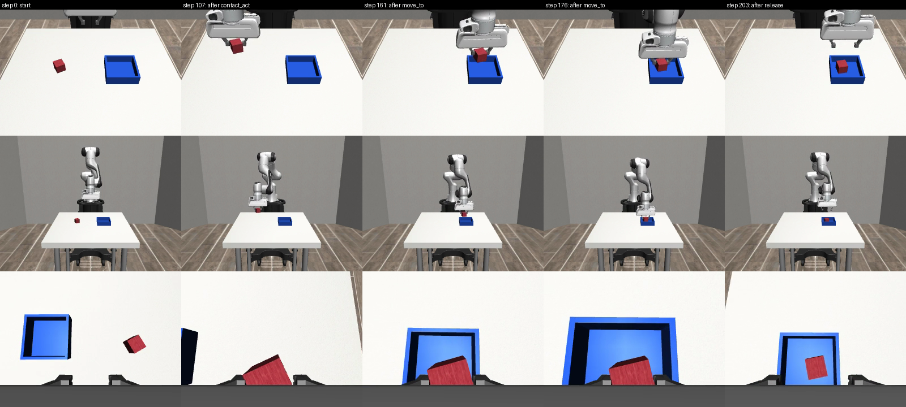

# harvest/ — HARVEST 最小可运行栈（L1 原语层 + L4 独立验证器 + 三层记录）

方案见 [`docs/proposal/PROPOSAL_agent_data_engine_zh.md`](../docs/proposal/PROPOSAL_agent_data_engine_zh.md)。这是其"立即可做的三件事"第 1 条的实现：跑通一条带三层记录的 block → bowl。

**现状（2026-09-08）**：本机没有可连接的真机（`robocore` 的 `RealRobotInterface` 是占位实现，无 ROS 2 / 机械臂 SDK），因此后端用 robosuite 1.5.2 + MuJoCo 3.3.3 的 Panda 臂；场景、相机（顶视 / 正视 / 腕部 RGB-D）与控制（OSC_POSE，20 Hz）都是真实仿真。硬件后端是一个六方法接口，接真机时只换 `harvest/backends/`。5 个随机种子全部由独立验证器判成功且与真值一致（5 TP，0 FP/FN）。



*一条 episode 的关键帧（上：顶视；中：正视；下：腕部）：起始 → contact_act 抓起 → move_to 碗上方 → move_to 下放 → release。*

## 运行

```bash
# 依赖：robocore 的虚拟环境（robosuite、mujoco、imageio、ffmpeg）；macOS 用 MUJOCO_GL=cgl 离屏渲染
cd awesome_agentic_robot/harvest
MUJOCO_GL=cgl /Users/liyufeng/Desktop/research/robocore/.venv/bin/python run_episode.py --seed 0 --out data/episodes/ep_0000
# 多种子
for s in 0 1 2 3 4; do MUJOCO_GL=cgl .../python run_episode.py --seed $s --out data/episodes/ep_000$s; done
# 用真实 LLM 规划器（OpenAI 兼容端点）代替脚本替身
OPENAI_API_KEY=... MUJOCO_GL=cgl .../python run_episode.py --agent llm --seed 0 --out data/episodes/llm_0000
```

一条 episode 约 200-240 个控制步、10-12 秒仿真时间、15-30 秒墙钟时间（含视频编码）。

## 五层对应的代码

| 层 | 文件 | 说明 |
|---|---|---|
| L1 原语与安全 | `harvest/primitives.py` | 固定词表 `move_to / set_gripper / release / contact_act / rotate_wrist`，JSON 调用，跑到后置条件或步数预算才返回；工作空间投影 + 每步位移限幅（规则 R10）；`contact_act(skill=grasp)` 是解析闭环抓取（接近 → 下降 → 闭合 → 抬起 → 按开度判定是否空抓），后续可替换为学习的 VLA / flow 头 |
| L2 Agent | `harvest/agent.py` | `ScriptedAgent`（脚本替身，每次命令前重新定位目标，规则 R05）与 `LLMAgent`（OpenAI 兼容端点，提示词模块沿用 Harness VLA 附录 E 的结构）共用同一接口：一轮一个 JSON 原语调用 |
| L3 规则记忆 | `harvest/rules.py` | 十条起始规则的规则对象（scope / condition / action / label / evidence / status / provenance）；引擎执行 R03 空抓、R07 重试预算、R10 安全投影，其余由原语层 / agent / 记录器强制；每次触发写入 `labels.json` |
| L4 独立验证器 | `harvest/verifier.py` | 只读 RGB-D、末端位姿、夹爪开度：`grasped`（开度 + 方块估计上升 >3 cm + 与末端 XY 距离 <4 cm）、`above_bowl`、`placed_in_bowl`（方块在碗底范围内、静置于碗底高度、夹爪张开、正视相机交叉验证）；真值谓词只在事后由记录器用于审计（TP/TN/FP/FN） |
| L5 三层记录 | `harvest/recorder.py` | `episode.json`（任务、种子、agent、成本、验证与审计）· `agent_log.jsonl`（推理）· `commands.jsonl`（意图层）· `trajectory.csv/.npz`（每控制步的末端、关节、夹爪、命令增量）· `top/front/wrist.mp4` · `labels.json`（阶段边界、规则触发）· `verifier.json` · `rules_snapshot.json` |
| 感知隔离 | `harvest/perception.py` | agent 拿不到物体位姿：颜色掩码选像素 → 深度反投影 → 多像素中位数（Harness VLA 附录 E.2 的定位规则）。顶视相机对方块 XY 误差 0.1 cm |
| 后端 | `harvest/backends/base.py`、`robosuite_backend.py`、`block_to_bowl_env.py` | 六方法接口 `reset / observe / servo_step / camera_model / pixels_to_world / oracle`；robosuite 实现与 BlockToBowl 任务（红色方块 + 蓝色容器"碗"，随机摆放） |

## 替身与真实的边界

- **真实**：仿真物理与渲染、原语的闭环执行与后置条件、安全投影、感知反投影、验证器的全部判据、三层记录、规则触发与审计。
- **替身**：`ScriptedAgent` 代替 LLM 规划器（本机无可用 API key）；`contact_act` 是解析抓取而非学习原语；颜色阈值代替检测器 / 分割器；`oracle()` 只在仿真里存在，真机上审计需改用人工抽检。
- **接真机要做的事**：实现 `RobotBackend` 的六个方法（相机内外参、像素到世界的反投影、Cartesian 增量伺服、夹爪），把 `Safety` 的工作空间改成真机工作区；其余代码不动。

## 样例数据

`data/episodes/ep_0001/` 作为样例入库（约 1 MB，含三路 20 Hz 视频）；其余 episode 由 `.gitignore` 排除，按需重跑生成。
